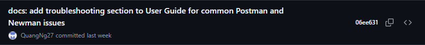

# PROJECT CONTRIBUTION — Task List

> - A task should be done by only 1–2 students. Duplicate tasks are not recommended.
> - Each member should work on at least 5 tasks.
> - Repository: https://github.com/Hoang105205/Group04-Topic06-API-Contract-Testing (branch `master`)

| No | Student ID | Full name | Task Description | Hours | Evidence (Git commit) |
|----|------------|-----------|------------------|-------|------------------------|
| 1 | 23127047 | Lưu Huy Hoàng | Initialize repository & create stage-based deliverable folder structure | 4 |  |
| 2 | 23127047 | Lưu Huy Hoàng | Draft seminar planning documents & team task assignment | 6 |  |
| 3 | 23127047 | Lưu Huy Hoàng | Write User Guide Section 1 – Introduction (API testing, tool selection, scope) | 5 |  |
| 4 | 23127047 | Lưu Huy Hoàng | Write User Guide Section 4 – API Authentication Testing Patterns (JWT, auth inheritance, failure tests) | 9 |  |
| 5 | 23127047 | Lưu Huy Hoàng | Refactor Section 4 into step-by-step instructions with screenshot placeholders | 6 |  |
| 6 | 23127047 | Lưu Huy Hoàng | Design the Contract Testing section outline for the User Guide | 3 |  |
| 7 | 23127047 | Lưu Huy Hoàng | Write User Guide Section 8 – References with verified external links | 4 |  |
| 8 | 23127047 | Lưu Huy Hoàng | Review and compile all member sections; finalize guide title | 7 |  |
| 9 | 23127047 | Lưu Huy Hoàng | Fix duplicated content in Section 6 during final compilation | 2 |  |
| 10 | 23127052 | Dương Gia Huy | Initialize Git repository (initial commit & project scaffold) | 2 |  |
| 11 | 23127052 | Dương Gia Huy | Write User Guide Section 5.1a – Test Scripts (pre-request, post-response, variable chaining) | 12 |  |
| 12 | 23127052 | Dương Gia Huy | Write User Guide Section 5.1b – Negative Testing & Error Handling | 10 |  |
| 13 | 23127052 | Dương Gia Huy | Align Postman test scripts & negative tests with live EShop SUT behavior | 8 |  |
| 14 | 23127052 | Dương Gia Huy | Finalize scripting workflow & negative tests; add result screenshots | 6 |  |
| 15 | 23127052 | Dương Gia Huy | Rename test cases & consolidate Postman collections into SUT-test-resource | 4 |  |
| 16 | 23127052 | Dương Gia Huy | Write personal AI Audit report & AI Disclosure form | 3 |  |
| 17 | 23127104 | Nguyễn Bình Minh Phương | Research Postbot; write User Guide Section 5.3 – Postbot AI-Generated Tests | 11 |  |
| 18 | 23127104 | Nguyễn Bình Minh Phương | Hands-on test Postbot on EShop SUT endpoints; capture comparison screenshots | 8 |  |
| 19 | 23127104 | Nguyễn Bình Minh Phương | Write User Guide Section 6 – Failure Modes (FM1/FM2/FM3) with real examples | 11 |  |
| 20 | 23127104 | Nguyễn Bình Minh Phương | Refine Sections 5.3 & 6 with experiment data and screenshots | 6 |  |
| 21 | 23127104 | Nguyễn Bình Minh Phương | Remove duplicated content in Section 6 | 2 |  |
| 22 | 23127104 | Nguyễn Bình Minh Phương | Write personal AI Audit report for Postbot research | 4 |  |
| 23 | 23127104 | Nguyễn Bình Minh Phương | Write & finalize personal AI Disclosure form | 3 |   |
| 24 | 23127125 | Nguyễn Hiếu Thuận | Finalize Tool Survey Proposal – review AI Capability section, shorten to 1-page PDF | 4 |  |
| 25 | 23127125 | Nguyễn Hiếu Thuận | Build SUT Postman Collection & Environment for the live demo | 6 |  |
| 26 | 23127125 | Nguyễn Hiếu Thuận | Write contract testing JSON schemas & update Postman collections | 7 |  |
| 27 | 23127125 | Nguyễn Hiếu Thuận | Write User Guide Section 4b – Contract Testing with Postman (schemas & images) | 9 |  |
| 28 | 23127125 | Nguyễn Hiếu Thuận | Refine Contract Testing content & examples in User Guide | 6 |  |
| 29 | 23127125 | Nguyễn Hiếu Thuận | Design Seminar Slides (PPTX) & interactive HTML slide deck | 10 |  |
| 30 | 23127125 | Nguyễn Hiếu Thuận | Finalize slides & demo (trim test cases, add AI templates, embed demo link) | 3 |   |
| 31 | 23127462 | Nguyễn Minh Quang | Add EShop demo app source code (demo-src backend) | 5 |  |
| 32 | 23127462 | Nguyễn Minh Quang | Add OpenAPI specification & Postman collection for EShop API | 5 |  |
| 33 | 23127462 | Nguyễn Minh Quang | Write User Guide Sections 2, 3 & 5.2 with demo data and images | 10 |  |
| 34 | 23127462 | Nguyễn Minh Quang | Add detailed configuration steps, screenshots & data-driven testing CSV | 6 |  |
| 35 | 23127462 | Nguyễn Minh Quang | Write User Guide Section 7 – Troubleshooting (Postman & Newman issues) | 6 |  |
| 36 | 23127462 | Nguyễn Minh Quang | Update User Guide with collection creation steps & images | 4 |  |
| 37 | 23127462 | Nguyễn Minh Quang | Update login test data + Collection Runner & Newman usage guide | 5 |  |
| 38 | 23127462 | Nguyễn Minh Quang | Replace Postman Runner results screenshot in User Guide | 2 |  |
| 39 | 23127462 | Nguyễn Minh Quang | Write personal AI usage disclosure & audit report | 2 |  |
| 40 | 23127047 | Lưu Huy Hoàng | Merge & consolidate team AI Audit Report into a single file | 2 |  |
| 41 | 23127047 | Lưu Huy Hoàng | Prepare Project Contribution task list & score sheet | 1 |   |
| 42 | 23127047 | Lưu Huy Hoàng | Write Reflective Statement & personal AI Disclosure | 2 |   |
| 43 | 23127052 | Dương Gia Huy | Finalize Stage 8 documentation (personal AI Audit input & AI Disclosure PDF) | 5 |  |
| 44 | 23127104 | Nguyễn Bình Minh Phương | Finalize Activity Worksheet for the audience activity | 5 |  |
| 45 | 23127125 | Nguyễn Hiếu Thuận | Finalize & submit personal AI Disclosure (PDF version) | 5 |  |
| 46 | 23127462 | Nguyễn Minh Quang | Finalize & submit personal AI Disclosure (PDF version) | 5 |  |
