# User Guide: API & Contract Testing with Postman & Postbot

## Demo Youtube Link
[Link](https://youtu.be/EHq4QRIPkGk)

## Section 1: Introduction

### What is API Testing?

API (Application Programming Interface) testing validates that the communication layer between software components works correctly — checking whether endpoints return the right data, handle errors properly, enforce authentication, and behave consistently under different inputs. Unlike UI testing, API testing operates directly on the request/response layer, making it faster, more reliable, and easier to automate.

### Why Postman?

**Postman** is the industry-standard tool for API testing, used by over 35 million developers worldwide. It provides an intuitive graphical interface for building, sending, and inspecting HTTP requests — without writing boilerplate code. Key features include:

- **Request Builder:** Compose GET, POST, PUT, DELETE requests with headers, parameters, and body — all through a visual interface.
- **Test Scripts:** Write JavaScript assertions (`pm.test()`) to validate status codes, response bodies, headers, and performance.
- **Collection Runner:** Execute an entire workflow (e.g., Login → Browse Products → Add to Cart → Checkout) in one click.
- **Newman CLI:** Run collections from the command line for automation and CI/CD pipeline integration.
- **Environment Variables:** Manage dynamic values (base URLs, tokens, credentials) across different setups.

### Why Postbot?

**Postbot** is Postman's built-in AI assistant (GA since 2024). It analyzes your request/response and automatically generates test assertions in JavaScript — reducing the effort of writing repetitive validation code. You can interact with Postbot through natural language prompts (e.g., *"Generate tests for status code and validate that each product has a positive price"*). Postbot is included in every Postman account at **50 AI credits per month** on the Free plan — sufficient for student and individual use.

### Tool Selection Context

This guide is part of a **Tool Survey** conducted for the Software Testing seminar. Three candidate tools were evaluated:

| Tool | Role | Verdict |
|------|------|---------|
| **Postman** | Traditional API testing tool | **Selected** — industry standard, low learning curve, excellent fit for e-commerce API flows |
| **Postbot** | AI-augmented test generation | **Selected** — rapidly generates assertions for complex JSON payloads, complements Postman |
| **Pact** | Contract testing (backup) | Not used in this seminar — designed for microservices; overkill for the monolithic EShop SUT |

The combination of **Postman + Postbot** was chosen because it eliminates framework complexity while providing both manual control and AI-assisted speed.

### Scope of This Guide

This guide focuses on three core capabilities:

1. **Test Scripts** — Writing JavaScript assertions to validate API responses (status codes, body structure, data types, response time).
2. **Collection Runner + Newman** — Automating end-to-end API workflows and running tests from the command line.
3. **Postbot (AI-augmented)** — Using Postman's AI assistant to generate test assertions, and understanding its strengths and limitations.

Additional features (Mock Servers, Monitors, Postman Flows, OpenAPI Import) are mentioned briefly in Section 5 but are not the primary focus.

### Target System

All examples in this guide use the **EShop SUT** (System Under Test) — a Node.js/Express e-commerce API provided for the course. The backend runs at `http://localhost:3000` and exposes endpoints for authentication, products, cart, checkout, coupons, and order management.

> **Note:** The EShop SUT contains intentional implementation gaps for learning purposes. This guide focuses on **how to use Postman and Postbot effectively**, not on finding bugs in the SUT.

---

## Section 2: Install & Setup

### Installation

1. **Postman Desktop App** — Download from https://www.postman.com/downloads/ (Windows/macOS/Linux)

   
2. **Create a Free Account** — 1 user, 50 AI credits/month (sufficient for Postbot)

   
3. **Newman CLI** — Requires Node.js & npm. Install via terminal:
   - Check if Node.js and npm are already installed by running:
     ```bash
     node -v
     npm -v
     ```
   - If not installed, download and install Node.js (which includes npm) from https://nodejs.org/.
   - Once Node.js & npm are verified, install Newman and the HTML reporter:
     ```bash
     npm install -g newman
     npm install -g newman-reporter-html
     ```

### Setup Environment in Postman

1. **Open/Create a Workspace**:
   - In the top-left corner of Postman, click **Workspaces**.
   - Select an existing workspace, or click **Create Workspace** to create a new workspace for your project (e.g., named "EShop Testing" for the EShop project).

     

     - Choose the appropriate **Visibility** type depending on your needs:
       - **Internal**: Only accessible by you (best for solo testing).
       - **Partner**: Shared with invited team members (best for group collaboration).
       - **Public**: Visible to anyone on the internet (used for publishing API docs).
2. **Create Collection**: In the left sidebar, click the **Collections** tab → click the plus button (`+`) or **Create Collection** → name your collection according to your project (e.g., "EShop API Collection"). A collection is a container that groups and organizes your API requests, making it easier to manage, run, and share tests.
   
3. **Create a new Environment**: Click the plus button (`+`) at the top of the left sidebar → select **Environment** → name it according to your project environment (e.g., "EShop Env").

   
4. **Add variables**: Add the required environment variables to store configuration values (such as URL, authentication credentials, dynamic parameters). Below is an example of configuration variables for the **EShop** system under test (SUT):

| Variable | Initial Value | Description |
|----------|--------------|-------------|
| `base_url` | `http://localhost:3000` | URL of EShop SUT |
| `username` | `test@eshop.com` | Test user |
| `password` | `Test1234!` | Test password |
| `auth_token` | *(leave empty)* | Authentication token (JWT) |
| `product_id` | *(leave empty)* | Product ID for testing |

5. **Select the Environment**: Choose the newly created environment (e.g., "EShop Env") from the environment dropdown in the top-right corner of Postman to apply the variables.

   

6. **Import Collection & Environment**: Import your project's API Collection and Environment files (e.g., the exported `.json` files of EShop API). Press `Ctrl + O` (or click the **Import** button in the left sidebar) → select the `.json` collection and environment files.

   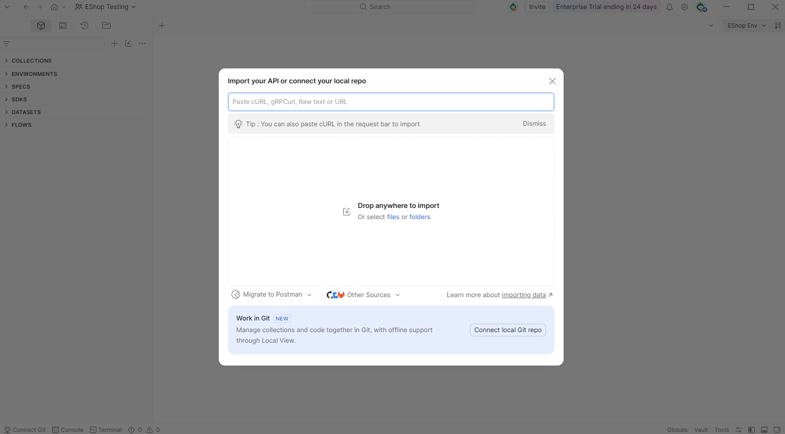

### Verify Connection

To verify that the setup is successful and the environment variables are active:
- Select a simple test endpoint in your collection (e.g., `GET {{base_url}}/api/products` in EShop).
- Click **Send**.
- If you receive a JSON response with status code `200 OK` (or other expected successful status), the connection is verified and successful.

  

---

## Section 3: First Test — Basic API Requests

### 4 Basic HTTP Methods

1. **GET `/api/products`** — Retrieve the list of products from SUT.
   - **Request Body**: None
   - **Response**: List of products in JSON format.
   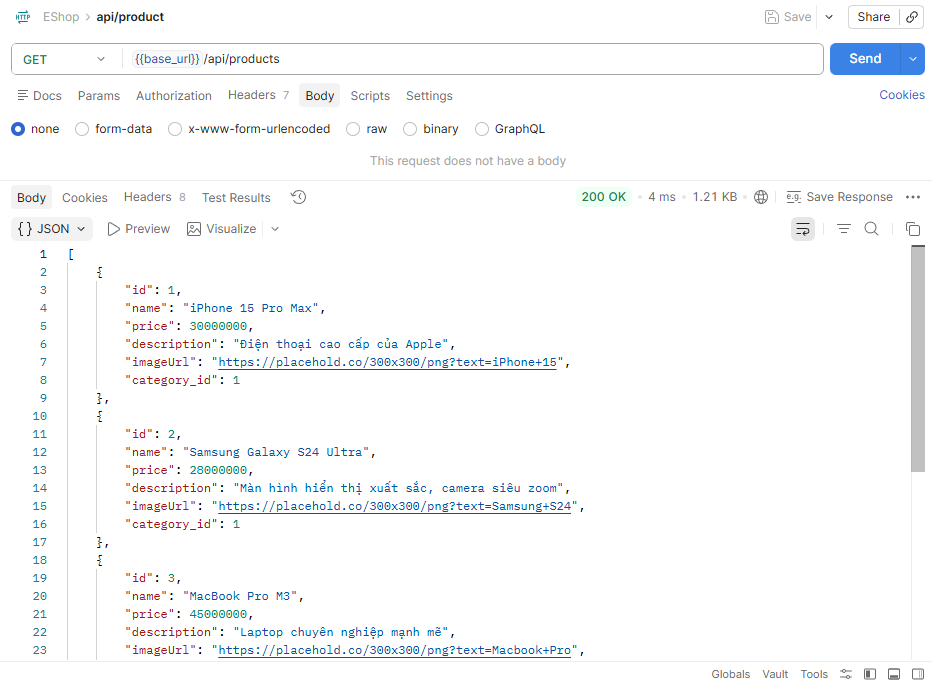

2. **POST `/api/login`** — Login and receive the JWT authentication token.
   - **Request Body**: `{ "email": "...", "password": "..." }`
   - **Response**: JSON containing the token.
   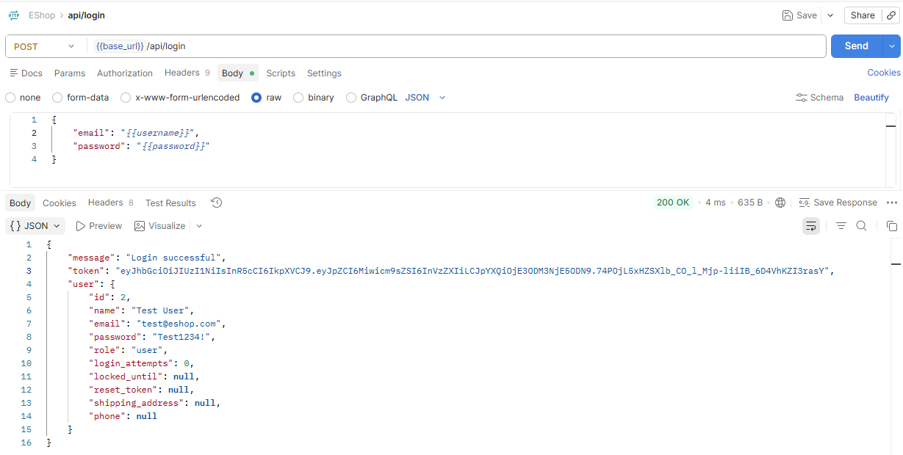

3. **PUT `/api/products/:id`** — Update a product's details.
   - **Path Variables**: Set the target `id` value under the **Params** tab.
   - **Request Body**:
    ```json
    { 
        "name": "Tên sản phẩm",
        "price": 100000,
        "description": "Mô tả",
        "imageUrl": "http://...",
        "category_id": 1
    }
    ```
   - **Response**: The updated product JSON.
   

4. **DELETE `/api/products/:id`** — Delete a product by its ID.
   - **Path Variables**: Set the target `id` value under the **Params** tab.
   - **Request Body**: None
   - **Response**: Status confirmation.
   


### Common HTTP Status Codes

| Code | Meaning | Occurrences |
|------|---------|-------------|
| **200** OK | Success | Successful GET or PUT request |
| **201** Created | Created | Successful POST request creating a resource |
| **400** Bad Request | Bad Input | Missing fields or invalid data types |
| **401** Unauthorized | Unauthenticated | Missing or invalid token |
| **403** Forbidden | Unauthorized | Valid token but lack of permissions |
| **404** Not Found | Not Found | Resource does not exist |
| **409** Conflict | Conflict | E.g., coupon has already been redeemed |
| **500** Internal Server Error | Server Error | Bug on the server-side |

### Authorization Tab in Postman

1. Open your Collection (or folder) → click the **Authorization** tab.
2. Select **Type**: `Bearer Token` → set **Token**: `{{auth_token}}`.
3. All child requests in this Collection will automatically inherit the `Authorization: Bearer <token>` header.
4. No need to manually set the Authorization header for each individual request.

---

## Section 4: API Authentication Testing Patterns

This section walks you through how Postman handles authentication — specifically **JWT Bearer Token**, which is the auth mechanism used by the EShop SUT. You will learn how to configure auth once and let Postman propagate it everywhere, test auth failure scenarios, and automate token management so you never have to copy-paste tokens by hand.

### 4.1 — Collections and Auth Inheritance

In Postman, a **Collection** is a group of related API requests. You should already have a collection with your requests imported from Section 2. Collections can also contain **sub-folders** to organize requests by feature area (e.g., "Auth", "Products", "Cart", "Orders"), making it easy to locate and run related requests together.

A key feature is **auth inheritance**: authorization settings applied at a parent level (Collection or folder) are automatically inherited by all child requests. Think of it like CSS cascading — you define a rule once at the top, and it flows down to every request inside. This eliminates the need to configure headers individually on dozens of requests.

#### Step-by-step: Configure Auth at the Collection Level

1. In the left sidebar, click on your **collection name** (e.g., `Demo Postman`). This opens the collection's overview panel, which contains several tabs such as: *Overview*, *Authorization*, *Variables*.
2. Click the **Authorization** tab.

   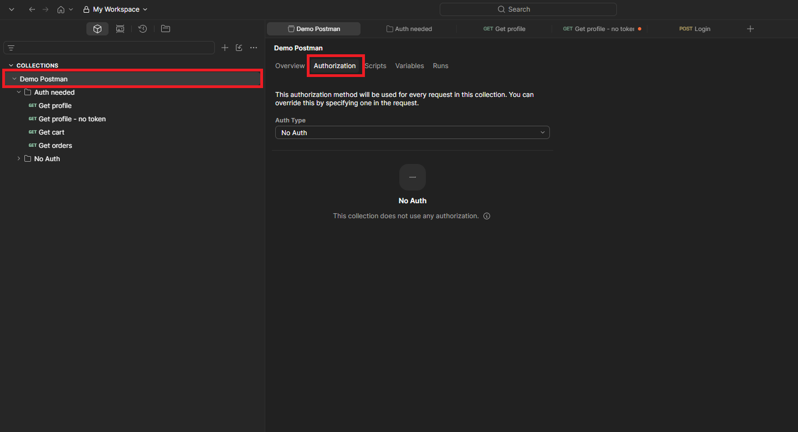

3. In the **Type** dropdown, you will see several options (No Auth, API Key, Basic Auth, Bearer Token, etc.). Select `Bearer Token` — this is the auth scheme used by the EShop SUT.
4. In the **Token** field that appears below, enter `{{auth_token}}`. The double curly braces tell Postman to resolve this value from your environment variables at runtime (see Section 2 for how `auth_token` was defined).

   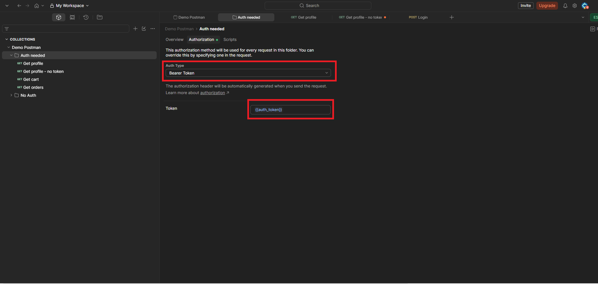

5. Click **Save** (`Ctrl + S`) to persist the collection-level auth configuration.
6. To verify inheritance is working: open any child request inside the collection (e.g., `GET /api/users/me`) → click its **Authorization** tab. The Type field should automatically show **Inherit auth from parent**, meaning this request will use whatever auth is configured at the collection level.

   <!-- 📸 Screenshot: A child request's Authorization tab showing "Inherit auth from parent" -->
   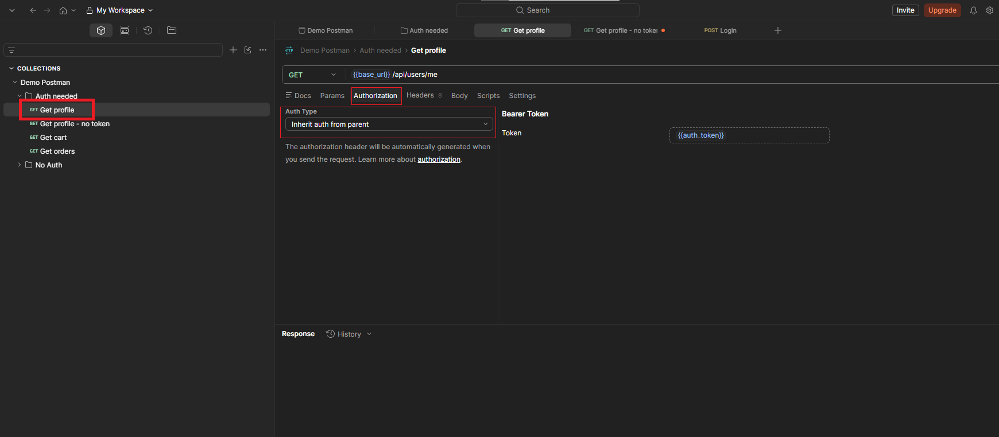

> **Key takeaway:** You configure auth **once** at the collection level, and every request inside automatically includes the `Authorization: Bearer <token>` header. If you ever need to override auth for a specific request or folder, you can change its Type to something other than "Inherit auth from parent" — but for the EShop SUT, inheritance is all you need.

### 4.2 — Testing Authentication with Bearer Token

The EShop SUT uses **JWT (JSON Web Token) Bearer Token** authentication. The flow works like this:

1. Client sends a login request (`POST /api/auth/login`) with username and password.
2. Server validates credentials and returns a JWT token in the response body.
3. Client includes that token in the `Authorization` header of every subsequent request:

```
Authorization: Bearer <token>
```

Not all endpoints require authentication. In the EShop SUT:
- **Public (no auth needed):** `GET /api/products`, `POST /api/auth/login`
- **Protected (auth required):** `POST /api/cart`, `GET /api/orders`, `POST /api/coupon/redeem`

With the collection-level auth you configured in 4.1, Postman handles the Authorization header automatically for every request. But a good tester doesn't just verify the happy path — we also need to confirm the API **rejects** requests that are missing authentication or carry invalid credentials.

#### Before You Start: Obtain a Valid Token

Before testing any protected endpoint, make sure you have a valid token:
1. Open the **Login** request (`POST {{base_url}}/api/auth/login`).
2. In the **Body** tab (raw JSON), ensure the credentials are correct:
   ```json
   {
       "username": "test@eshop.com",
       "password": "Test1234!"
   }
   ```

   Or you can use environment variables to store the credentials and then reference them in the request body for easier management and reuse of the credentials:
   ```json
   {
       "username": "{{user_email}}",
       "password": "{{user_password}}"
   }
   ```
3. Click **Send** → the response body should contain a `token` field (a long JWT string like `eyJhbGciOiJIUzI1NiIs...`).

   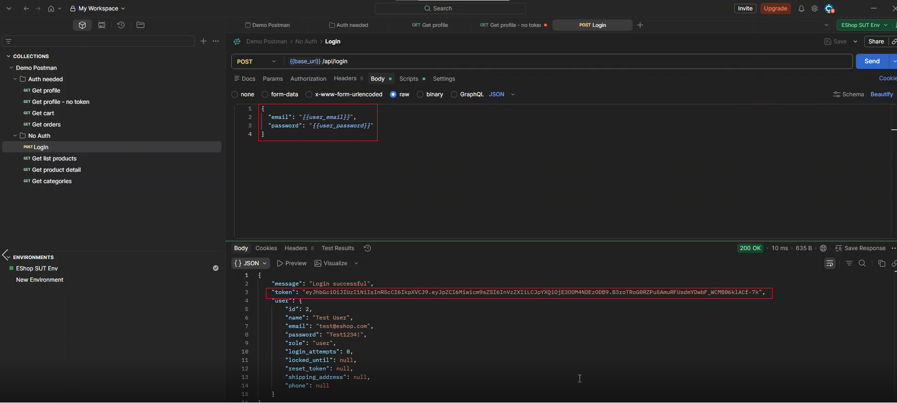

> If you already configured the auto-save technique from Section 4.3, the token is automatically stored in `{{auth_token}}`. For now, let's focus on testing auth behavior.

#### Step-by-step: Verify Authenticated Request Works (Happy Path)

1. Open a protected endpoint, such as `GET {{base_url}}/api/users/me`.
2. Confirm the **Authorization** tab shows **Inherit auth from parent** (meaning it uses the collection-level Bearer Token with `{{auth_token}}`).
3. Click **Send**.
4. You should receive a **`200 OK`** response with the user data in the response body.

   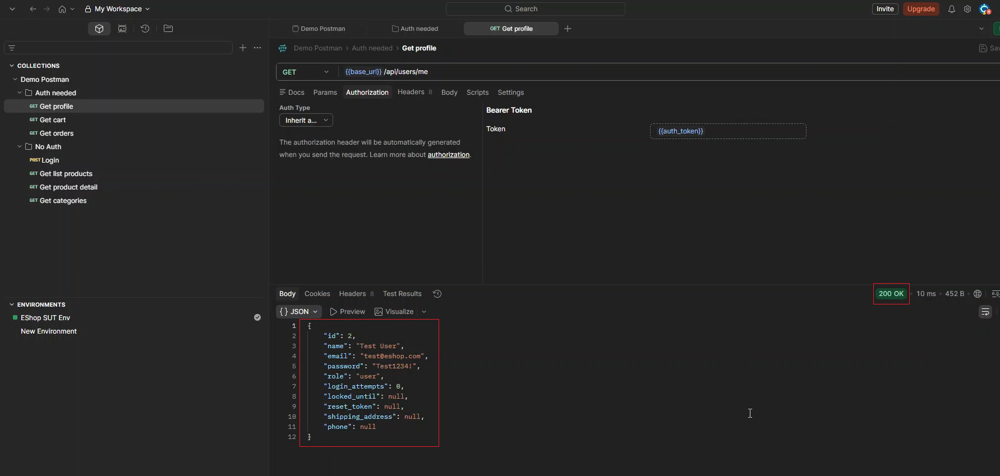

This confirms the full auth chain is working: login → token → inherited header → successful access.

#### Step-by-step: Test "No Token" Scenario (Expect 401)

**Why test this?** A secure API must actively refuse requests that arrive with no authentication at all. If the server returns `200 OK` without a token, that's a security vulnerability — anyone could access protected data.

1. On the same request (`GET /api/orders`), click the **Authorization** tab.
2. Change the **Type** dropdown from `Inherit auth from parent` to `No Auth`. This strips the `Authorization` header from the request entirely.

   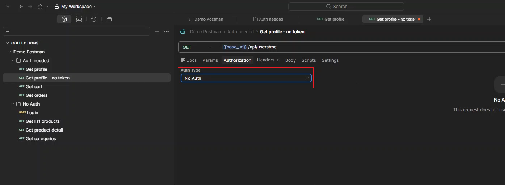

3. Click **Send**.
4. The server should return **`401 Unauthorized`** with an error message like `"Missing or invalid Authorization header"` — confirming that unauthenticated access is properly blocked.

   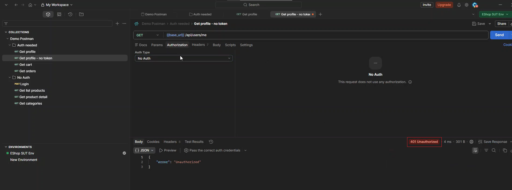

5. **Important:** Restore the Authorization Type back to `Inherit auth from parent` before moving on to the next test.

#### Step-by-step: Test "Fake/Invalid Token" Scenario (Expect 401)

**Why test this?** A different kind of threat: what if someone sends a request with a token that *looks* structurally valid but was never issued by the server? The API must detect this and reject it. This is different from the "no token" test — here, a token is present, but the server's JWT verification fails because the token was not signed by the server's secret key.

1. On the same request, click the **Authorization** tab.
2. Change the **Type** dropdown to `Bearer Token` (overriding the inherited setting for this specific request).
3. In the **Token** field, type a random/fake string (e.g., `abc` or any gibberish).

   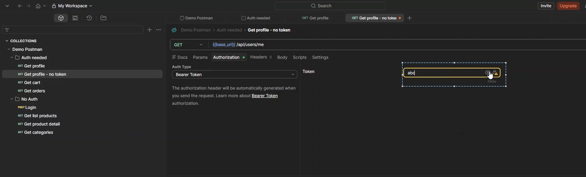

4. Click **Send**.
5. The server should return **Error**. The EShop SUT's auth middleware uses JWT verification (`jwt.verify()`) — if the token signature doesn't match the server's secret key, the request is rejected immediately.

   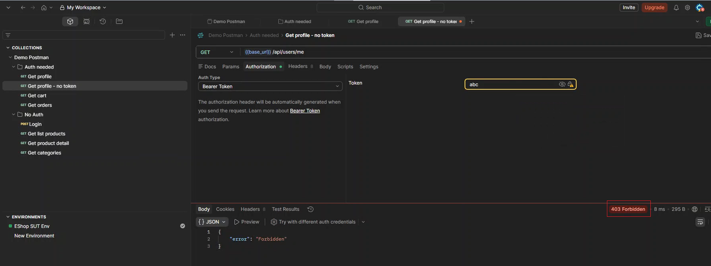

6. **Important:** Restore the Authorization Type back to `Inherit auth from parent`.

#### Summary of Auth Failure Test Cases

| Test Case | Setup | Expected Status | Error Message | What It Proves |
|-----------|-------|----------------|---------------|----------------|
| **Valid token** | Inherit from parent (collection Bearer Token) | `200 OK` | — | Auth chain works end-to-end |
| **No token** | Set Type to "No Auth" | `401 Unauthorized` | `Missing or invalid Authorization header` | API blocks unauthenticated access |
| **Fake/invalid token** | Enter a random string as Bearer Token | `401 Unauthorized` (But because the SUT is designed to have bugs so it currently return `403 Forbidden`) | `Invalid or expired token` | API rejects tokens not issued by the server |

> **Note:** Because the EShop SUT is designed to have bugs, the actual response for a fake or invalid token may be `403 Forbidden` instead of `401 Unauthorized`.

### 4.3 — Eliminating Manual Token Management

#### The Problem

At this point, you've probably noticed a friction point in the workflow. Every time you want to test an authenticated endpoint, you need to:

1. Send the login request (`POST /api/auth/login`) → receive a JWT token in the response body.
2. **Manually select and copy** the long token string from the response JSON.
3. Open your **Environment** settings → find the `auth_token` variable → **paste** the token into the *Current Value* field.
4. Only then can your other requests use `{{auth_token}}` successfully.

This manual copy-paste cycle is tedious, error-prone (it's easy to copy only part of the token), and breaks your testing flow — especially when you need to re-authenticate frequently (tokens expire, the server restarts, or you switch between test users).

#### The Solution: Automatic Token Extraction

Postman provides a built-in mechanism to **automatically capture values from a response and store them in environment variables** — eliminating the manual copy-paste entirely. The idea is simple:

> *"After the login response arrives, check if it contains a token. If yes, save that token directly into the `auth_token` environment variable — so the very next request can use it without any human intervention."*

This is accomplished through a small piece of logic added to the login request's **Post-response** phase. You don't need to understand JavaScript deeply — just follow the steps below.

#### Step-by-step: Configure Auto-Save on the Login Request

1. Open the **Login** request (`POST {{base_url}}/api/auth/login`).
2. Below the URL bar, click the **Scripts** tab. You will see two sub-tabs: *Pre-request* and *Post-response*.
3. Select the **Post-response** sub-tab — this is where you place logic that runs **after** the server responds.

   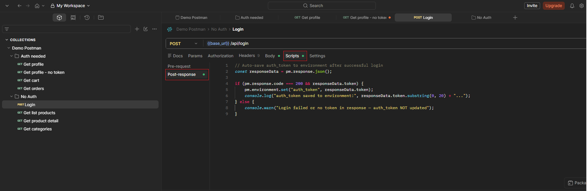

4. In the code editor area, paste the following code:

   ```javascript
   // Auto-save auth_token to environment after successful login
   const responseData = pm.response.json();

   if (pm.response.code === 200 && responseData.token) {
      pm.environment.set("auth_token", responseData.token);
      console.log("auth_token saved to environment:", responseData.token.substring(0, 20) + "...");
   } else {
      console.warn("Login failed or no token in response — auth_token NOT updated");
   }
   ```

   **What this does, line by line:**
   - `pm.response.json()` — parses the raw response body into a JavaScript object so we can read its fields.
   - `pm.response.code === 200` — only proceed if the login was successful (status 200).
   - `responseData.token` — check that the response actually contains a token field.
   - `pm.environment.set("auth_token", ...)` — write the token value into the `auth_token` environment variable.
   - `console.log(...)` — print a confirmation message in the Postman Console for debugging.

   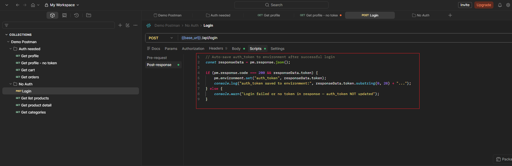

5. Click **Save** (`Ctrl + S`), then click **Send** to execute the login request.

6. Now open any protected request (e.g., `GET {{base_url}}/api/users/me`) and click **Send** — it works immediately. No copy, no paste, no switching tabs. The token is already there.

#### How It Works (Request Lifecycle)

| Phase | What Happens |
|-------|-------------|
| **1. You click Send** | Postman fires `POST /api/auth/login` with your credentials |
| **2. Server responds** | Response body contains `{ "token": "eyJhbG..." }` |
| **3. Post-response logic runs** | The code extracts `responseData.token` and writes it into the `auth_token` environment variable |
| **4. Next request** | Any request using `{{auth_token}}` in its Authorization header now has the fresh token — ready to go |

#### Troubleshooting Tips

- **Token not saving?** Open the **Postman Console** (`Ctrl + Alt + C`) and look for the `"auth_token saved to environment"` message. If it's missing, the post-response code may not have run — check that it's in the *Post-response* tab (not *Pre-request*).
- **Server returned an error?** If the login fails (wrong credentials, server down), the `if` condition (`pm.response.code === 200`) prevents overwriting a good token with garbage. This is a safety guard.

> **Key takeaway:** This technique is not about learning to code — it's about **solving a real workflow problem**. Once you configure this on your login request, token management becomes fully automatic for the rest of your testing session. You login once, and every subsequent request just works.

---

## Section 4b: Contract Testing with Postman

### 4b.1 — What is Contract Testing?

API testing spans across multiple levels — from unit tests and functional tests to end-to-end integration tests. Among these, **Contract Testing** plays a unique role. It validates that the communication between an API provider (the backend server) and an API consumer (the frontend client or another service) adheres strictly to a predefined, agreed-upon "contract."

A contract defines the exact interface of the API, which includes:
- **Status Codes:** The expected HTTP status codes returned for both success and error paths (e.g., `200 OK`, `201 Created`, `400 Bad Request`, `401 Unauthorized`, `404 Not Found`).
- **Headers:** Required response headers (e.g., `Content-Type: application/json`, `Authorization`).
- **Data Structure (JSON Schema):** The shape of the JSON response, including key names, required properties, expected data types (strings, integers, arrays, booleans, objects), nested structures, and value boundaries (e.g., positive numbers, specific format constraints like emails).
- **Behavioral Patterns:** Consistent error messages and payload structures under negative scenarios.

#### Contract Testing vs. Traditional Functional Testing
While functional testing verifies that the API's business logic works correctly (e.g., adding an item to the cart actually updates the database and calculates the correct price), contract testing focuses entirely on the **structural interface**. It ensures that the client application can safely consume the API response without encountering runtime data-type mismatches or missing properties that could cause frontend crashes (e.g., trying to read a property from `null` or a missing field).

#### Consumer-Driven Contract Testing (CDC)
In large microservice architectures, contract testing is often **consumer-driven**. In this model, the client/consumer applications define their expectations of the API first, which are serialized into contract files (e.g., using a tool like Pact). These contracts are then run against the backend provider to verify compatibility. Since the EShop SUT is a monolithic system where the provider and consumer are within the same context, a full consumer-driven contract testing tool like Pact is overkill. However, implementing **lightweight contract tests** using Postman test scripts is highly effective in ensuring that no breaking changes are introduced to the API schema during development.

### 4b.2 — How Postman Implements Contract Testing

> **Quick Start & Navigation Note:** If you are a beginner and want a step-by-step walkthrough on how to navigate Postman's script workspace, enter scripts, and run test assertions for the first time, please see [Section 5.1a — Test Scripts](#51a--test-scripts) for a detailed visual guide before studying the schemas below.

Postman provides robust, built-in features that make it easy to write and maintain contract tests without setting up complex testing frameworks.

#### 1. JSON Schema Validation via `pm.response.to.have.jsonSchema()`
At the heart of Postman's contract testing capability is the `pm.response.to.have.jsonSchema(schema)` assertion. Postman integrates the **Ajv validator (v6.12.5)**, a fast JSON Schema validator. With it, you can declare the expected response structure in a standard JSON Schema draft-07 format and assert that the server response complies with it in a single statement.
The validator checks:
- **Data Types:** Validates that properties are strings, integers, arrays, objects, booleans, or null.
- **Required Fields:** Ensures that crucial properties are always present in the response.
- **Formats:** Validates string formats such as `email`, `date-time`, or `uri`.
- **Value Constraints:** Enforces minimum/maximum values, enum values (allowable string options), and array length.

#### 2. Response Structure Assertions
Beyond raw schema validation, Postman's post-response scripting sandbox enables you to verify other aspects of the contract:
- **Status Code Validation:** `pm.response.to.have.status(200)` checks that the endpoint returns the correct status code.
- **Header Verification:** `pm.response.to.have.header("Content-Type", "application/json; charset=utf-8")` ensures the data is returned in the correct format.
- **Performance Agreements (SLA):** `pm.expect(pm.response.responseTime).to.be.below(800)` asserts that the API meets performance requirements.

#### 3. Saved Examples and Mock Servers
Every request in Postman can save its responses as **Examples**. These saved examples serve as the documentation of the API contract. Postman Mock Servers can then use these saved examples to spin up a mock API endpoint. This mock server matches incoming request paths, headers, and bodies against the saved contract examples and returns the predefined responses. This allows frontend developers to write their code against the Mock Server before the real backend is even implemented.

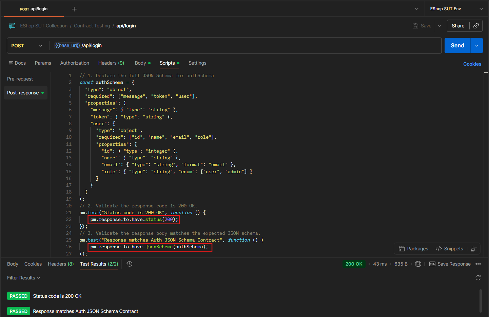

### 4b.3 — EShop SUT Contract Testing Implementation

To organize contract tests cleanly and avoid cluttering the functional test suite, we created a dedicated folder named **`Contract Testing`** inside both the positive collection (`SUT_Contract_Collection.json`) and the negative collection (`SUT_Contract_Negative_Collection.json`).

Inside the **`Contract Testing`** folder, requests contain full contract validation scripts. For the root-level requests outside the folder, contract testing assertions are removed, ensuring the main collections remain clean.

Below are the contract testing schemas and post-response script templates implemented for the EShop SUT endpoints.

#### 1. POST /api/login
- **Contract Goal:** Verifies that a successful login returns a `200 OK` status, a JWT token string, and a user object containing the correct user profile details.
- **Environment Action:** Automatically extracts and saves the `auth_token` and `user_id` to the environment variables upon successful validation, enabling standalone execution of the contract testing folder.
- **Test Script:**
```javascript
// 1. Declare the full JSON Schema for authSchema
const authSchema = {
  "type": "object",
  "required": ["message", "token", "user"],
  "properties": {
    "message": { "type": "string" },
    "token": { "type": "string" },
    "user": {
      "type": "object",
      "required": ["id", "name", "email", "role"],
      "properties": {
        "id": { "type": "integer" },
        "name": { "type": "string" },
        "email": { "type": "string", "format": "email" },
        "role": { "type": "string", "enum": ["user", "admin"] }
      }
    }
  }
};

// 2. Validate the response code is 200 OK
pm.test("Status code is 200 OK", function () {
    pm.response.to.have.status(200);
});

// 3. Validate the response body matches the expected JSON schema
pm.test("Response matches Auth JSON Schema Contract", function () {
    pm.response.to.have.jsonSchema(authSchema);
});

// 4. Save Auth Token and User ID to environment variables if login is successful
if (pm.response.code === 200) {
    const responseData = pm.response.json();
    pm.environment.set("auth_token", responseData.token);
    pm.environment.set("user_id", responseData.user.id);
}
```

#### 2. GET /api/products
- **Contract Goal:** Asserts that the products catalog endpoint returns a list (array) of product objects, where each product contains mandatory properties like `id`, `name`, `price`, `description`, `imageUrl`, and `category_id` with valid types.
- **Test Script:**
```javascript
// 1. Declare the products list JSON Schema
const productsSchema = {
  "type": "array",
  "items": {
    "type": "object",
    "required": ["id", "name", "price", "description", "imageUrl", "category_id"],
    "properties": {
      "id": { "type": "integer" },
      "name": { "type": "string" },
      "price": { "type": "number", "minimum": 0 },
      "description": { "type": "string" },
      "imageUrl": { "type": "string" },
      "category_id": { "type": "integer" }
    }
  }
};

// 2. Validate the response code is 200 OK
pm.test("Status code is 200 OK", function () {
    pm.response.to.have.status(200);
});

// 3. Validate the response body against the JSON Schema contract
pm.test("Products list matches JSON Schema Contract", function () {
    pm.response.to.have.jsonSchema(productsSchema);
});
```

#### 3. POST /api/apply-coupon
- **Contract Goal:** Asserts that applying a valid discount coupon returns a success status boolean flag, the coupon ID, the discount amount deducted, the final checkout amount, and a friendly message.
- **Test Script:**
```javascript
// 1. Declare the expected JSON schema for applying a coupon successfully
const couponSchema = {
  "type": "object",
  "required": ["success", "coupon_id", "discount_amount", "final_amount", "message"],
  "properties": {
    "success": { "type": "boolean" },
    "coupon_id": { "type": "integer" },
    "discount_amount": { "type": "number" },
    "final_amount": { "type": "number", "minimum": 0 },
    "message": { "type": "string" }
  }
};

// 2. Validate the response status code is 200 OK
pm.test("Status code is 200 OK", function () {
    pm.environment.set("discount_amount", pm.response.json().discount_amount);
    pm.response.to.have.status(200);
});

// 3. Validate the response body matches the expected JSON schema
pm.test("Coupon validation matches JSON Schema Contract", function () {
    pm.response.to.have.jsonSchema(couponSchema);
});
```

#### 4. Negative Testing: Error Response Contracts
Testing error conditions is a vital part of contract testing. We must guarantee that the API returns a consistent error envelope when things go wrong so that client applications can handle failures gracefully without crashing.
The global contract for errors in the EShop SUT specifies a `400 Bad Request`, `401 Unauthorized`, or `404 Not Found` response with a JSON object containing a mandatory string property `error`.

##### Example: POST /api/apply-coupon (Error Schema Validation)
When a coupon validation fails, it must return a `400 Bad Request` status and a structured error payload.
```javascript
// 1. Define the JSON schema for error responses
const errSchema = {
  "type": "object",
  "required": ["error"],
  "properties": {
    "error": { "type": "string" }
  }
};

// 2. Validate the response status code is 400 Bad Request
pm.test("Status code is 400 Bad Request", function () {
    pm.response.to.have.status(400);
});

// 3. Validate the response body against the error JSON schema
pm.test("Error response matches Error JSON Schema Contract", function () {
    pm.response.to.have.jsonSchema(errSchema);
});
```

##### Capturing SUT Implementation Bugs via Contract Tests
During the validation execution against the EShop SUT, our contract tests successfully captured two API bugs (RESTful design mismatches):
1. **GET /api/products/999 (Product Not Found):** Instead of returning `404 Not Found`, the server returned a `200 OK` status without the requested product details and without an `error` property. The contract test caught this by asserting:
   - Expected status: `404 Not Found`
   - Expected response matches: `errSchema`
   - Result: **FAILED** (Captured status `200` instead of `404`).
2. **POST /api/cart (Add Invalid Product ID):** Sending product ID `-1` returned `200 OK` with `"message": "Added to cart"`, representing a lack of server-side validation. The contract test caught this by expecting a `400 Bad Request` status and `errSchema` response, failing and highlighting the bug.

##### GET /api/products/999 (Product Not Found) FAILED Assertion:
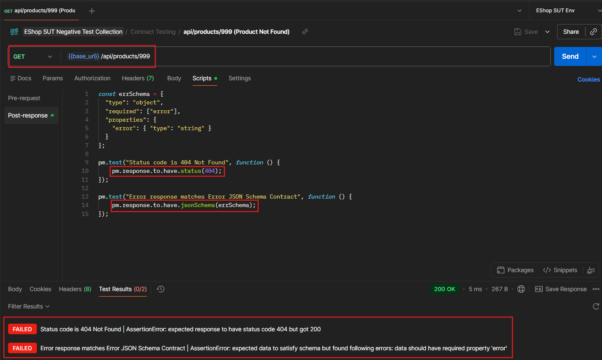

##### POST /api/cart (Add Invalid Product ID) FAILED Assertion:
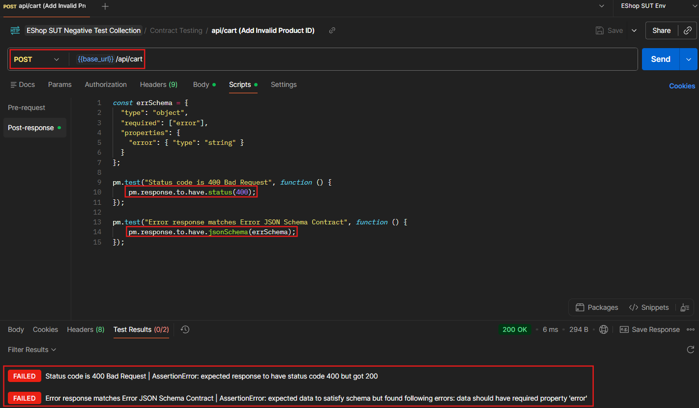

### 4b.4 — Comparison: Postman vs. Dedicated Contract Testing Tools

To understand where Postman fits in the contract testing landscape, here is a comparison between Postman's built-in capabilities and a dedicated consumer-driven contract testing tool like **Pact**:

| Aspect | Postman (Built-in) | Pact (Dedicated CDC Tool) |
| :--- | :--- | :--- |
| **Schema Validation** | Full JSON Schema verification via Ajv | Schema verification through Pact matching |
| **Status Code Checks** | Easy assertions (`pm.response.to.have.status`) | Yes, defined in Pact contract files |
| **Consumer/Provider Separation** | No formal separation (tests are coupled to API run) | Clear decoupled contracts (Pact broker) |
| **Detection of Breaking Changes** | Semi-automated (requires test collection execution) | Automated (breaks provider build in CI/CD pipeline) |
| **Mock Stubbing** | Saved examples can serve as mock servers | Generates mock provider stubs automatically |
| **Setup & Complexity** | Low (No infrastructure, write tests directly in IDE) | High (Requires Pact framework, Broker host, code mocks) |
| **Ideal Architecture** | Monoliths, smaller services, single-team setups | Distributed microservices, independent team deployments |

#### Verdict for EShop SUT
For our monolithic EShop SUT, **Postman's built-in contract testing is the optimal choice**. It provides immediate feedback without the high learning curve and configuration overhead of Pact, which requires setting up a Pact Broker and writing complex consumer/provider mock frameworks.

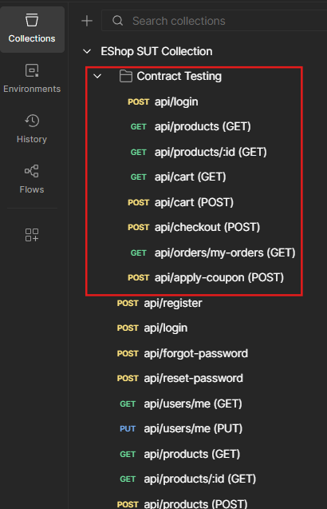

---

## Section 5: Advanced Usage

### 5.1a — Test Scripts

### Test Scripts in Postman
API testing requires more than just checking if a request returns a `200 OK` status. Postman allows testers to write JavaScript code to automate data preparation and validate complex API behaviors. 

Think of these scripts as the automated logic surrounding your API calls. They are divided into two distinct execution phases:
1. **Pre-request Scripts:** Code that executes *before* the HTTP request is sent to the server.
2. **Post-response Scripts (Tests):** Code that executes *after* the HTTP response is received from the server.

### How to Navigate to the Scripts Interface
Before diving into the code, here is how you can locate the scripting workspace in Postman:
1. Open any API request in your Collection.
2. Look at the tab menu directly below the URL bar and click on the **Scripts** tab.
   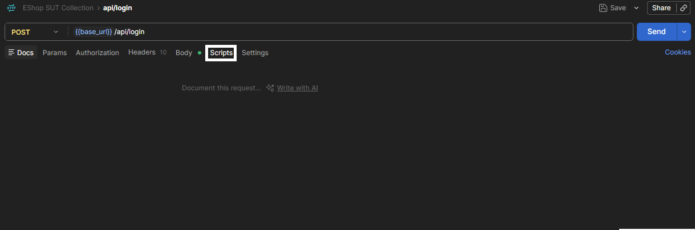
3. Inside the Scripts tab, you will see two sub-tabs: **Pre-request** and **Post-response**. Select the appropriate tab based on when you want your code to run.
   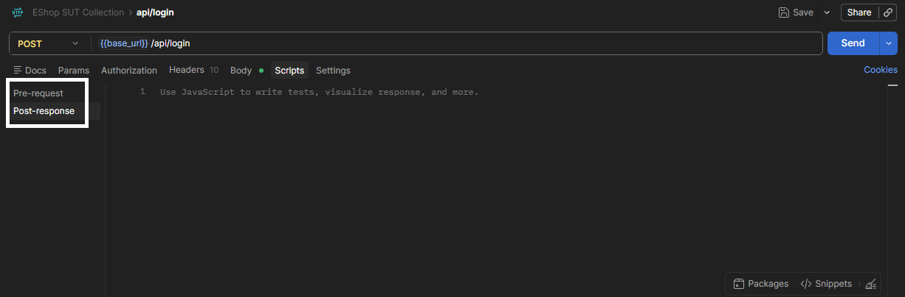
4. Write your JavaScript code in the editor below and click **Save** (or press `Ctrl + S`).

#### 1. Pre-request Scripts (Dynamic Data Preparation)
These scripts run before the request is sent to prepare the environment and payload. This is primarily used to prevent data collisions, such as dynamically generating a unique email for each test run to avoid "User already exists" errors.

If we were testing a registration endpoint `POST /api/register`, we could use this setup phase to generate a dynamic email to ensure a clean test run every time:
```javascript
const randomEmail = `test_${Math.floor(Math.random() * 10000)}@eshop.com`;
pm.environment.set("email", randomEmail);
```

*Note: After setting this variable, you can use `{{email}}` inside your JSON request body (e.g., `{"email": "{{email}}"}`) to ensure the API receives a fresh email on every run.*

#### 2. Post-response Scripts (Assertions & Variable Chaining)
Once the server replies, you need to verify if the data is correct or extract specific values to use in future requests. This is handled in the Post-response tab (historically called "Tests" in older Postman versions).

**Variable Chaining:** Instead of manually copying IDs from one response to another, we can extract values and store them dynamically to automate an entire end-to-end workflow.<br>
For a complete E-commerce flow, you chain requests by capturing outputs and passing them as inputs to the next step:
1. **Login:** Extract the token and user ID from `POST /api/login` and set `{{auth_token}}` and `{{user_id}}`.
2. **User Information:** Extract the credentials of the current user from `GET /api/users/me` and set `{{name}}` and `{{shipping_address}}`.
3. **Products:** Extract a product's name and price from `GET /api/products` and set `{{product_name}}` and `{{product_price}}`.
4. **Cart:** Inject `{{product_id}}`, `{{product_name}}`, and `{{product_price}}` into the `POST /api/cart` payload to add a product to the cart.
5. **Get Cart Information:** Use `GET /api/cart` to retrieve all products in the cart, calculate the sum of their prices, and set `{{sum_money}}`.
6. **Orders:** Inject `{{sum_money}}` and `{{shipping_address}}` into `POST /api/checkout` to complete the checkout.

Here is how you would script this entire chain step-by-step to automate the workflow.<br>
First, capture the token and user ID from the `POST /api/login` response:
```javascript
const responseData = pm.response.json();

pm.test("Save Auth Token and User ID", function () {
     pm.environment.set("auth_token", responseData.token);
     pm.environment.set("user_id", responseData.user.id);
});
```

*Note: Postman will automatically create these environment variables for you if they haven't been created yet.*

Next, extract the personal details from the `GET /api/users/me` response to use later in the checkout process:
```javascript
const user = pm.response.json();

pm.test("Save User Credentials", function () {
    pm.environment.set("name", user.name);
    pm.environment.set("shipping_address", user.shipping_address);
});
```

Then, dynamically grab the product's ID, name and price of the first available item in the `GET /api/products` response array:
```javascript
const products = pm.response.json();

pm.test("Save First Product ID, Name & Price", function () {
    // Check if the array has items to avoid runtime errors
    if(products.length > 0) {
        pm.environment.set("product_id", products[0].id);
        pm.environment.set("product_name", products[0].name);
        pm.environment.set("product_price", products[0].price);
    }
});
```

The workflow now moves to the `POST /api/cart` endpoint. Here, you inject the saved variables into your request body (JSON payload) to add the item to the cart.

*Note: If the variable represents a string, you must wrap it in quotes within your JSON body (e.g., `"name": "{{product_name}}"`). For numbers, quotes are not needed (e.g., `"price": {{product_price}}`).*

Once the product is added, you need to call the `GET /api/cart` endpoint to calculate the total order value. The script below iterates through the returned array of cart items, sums up the prices, and stores the result:

```javascript
const cartItems = pm.response.json();

pm.test("Calculate and Save Total Sum", function () {
    let total = 0;
    
    // Ensure the response is an array before calculating
    if (Array.isArray(cartItems) && cartItems.length > 0) {
        cartItems.forEach(item => {
            total += item.price; 
        });
    }
    
    pm.environment.set("sum_money", total);
});
```

Finally, for the `POST /api/checkout` endpoint, you inject `{{sum_money}}` and `{{shipping_address}}` into the checkout payload. Since this is the end of the flow, you no longer need to extract new variables. You simply validate that the server processed the order successfully:
```javascript
pm.test("Order placed successfully (Status 200)", function () {
    pm.response.to.have.status(200);
});
```

*Note: Currently, the API returns a `200 OK` status code upon successful addition instead of the standard `201 Created` typically used for resource creation.*

After executing your entire automated sequence, you can visually verify that all data was successfully extracted and stored.

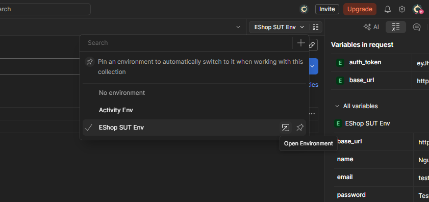

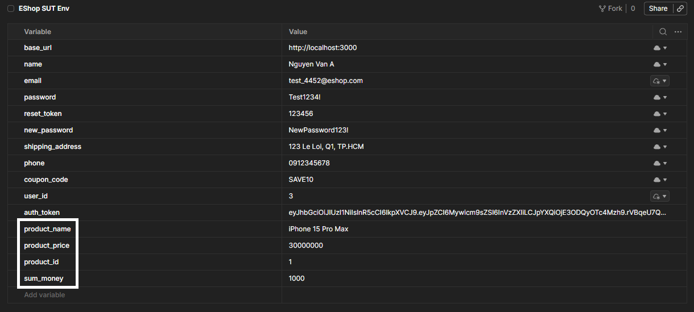

*Note: To verify these stored values, click on your active environment name (**EShop SUT Env** here in our current example) in the top right corner, then click the **Open Environment** button. You will see all your chained variables mapped perfectly. Notice how pre-existing variables like `auth_token` and `user_id` were seamlessly updated with fresh data, while new contextual variables like `product_name`, `product_price`, `product_id`, and `sum_money` were dynamically generated during the flow.*

By mastering this extraction, calculation, and injection pattern, you can fully automate complex, multi-step business workflows without any manual intervention.

**Data Validation:** Beyond extracting variables, Post-response scripts are crucial for validating the structure and performance of the returned data. We achieve this using the built-in Chai.js assertion library inside the `pm.expect()` block.

To master data validation, let's break it down into three core concepts:


**a. Asserting Response Time**

Performance matters just as much as correct data. You can easily assert that an endpoint responds within an acceptable timeframe to ensure a smooth user experience.
```javascript
pm.test("Response time is acceptable (< 800ms)", function () {
    // Validates that the request took less than 800 milliseconds to complete
    pm.expect(pm.response.responseTime).to.be.below(800);
});
```

**b. Validating Fundamental Data Types and Nested Properties**

When testing an endpoint like `POST /api/login`, you must ensure the server returns the exact data types expected by the client (e.g., strings for tokens, numbers for IDs). Furthermore, you need to drill down into nested JSON objects (like the `user` object inside the main response) to verify their internal structure.
```javascript
pm.test("Validate Login Schema, Data Types, and Nested Objects", function () {
    const responseData = pm.response.json();
    
    // 1. Validate flat properties (root level)
    pm.expect(responseData).to.be.an('object');
    pm.expect(responseData).to.have.property('message').that.is.a('string');
    pm.expect(responseData).to.have.property('token').that.is.a('string');
    
    // 2. Validate nested JSON objects (the 'user' object)
    pm.expect(responseData).to.have.property('user').that.is.an('object');
    
    // 3. Drill down into the nested object's data types
    pm.expect(responseData.user).to.have.property('id').that.is.a('number');
    pm.expect(responseData.user).to.have.property('email').that.is.a('string');
});
```

**c. Validating Array Length and Contents**

For endpoints that return lists of items, such as `GET /api/products`, verifying fundamental data types isn't enough. You must also verify that the response is actually an array and validate its length (e.g., ensuring it isn't empty, or it contains a specific number of elements).
```javascript
pm.test("Validate Array Structure and Length", function () {
    const products = pm.response.json();
    
    // Ensure the response is explicitly an array format
    pm.expect(products).to.be.an('array');
    
    // Ensure the array is not empty (length > 0)
    pm.expect(products).to.not.be.empty;
    
    // Alternatively, if you expect an exact number of items, use lengthOf:
    // pm.expect(products).to.have.lengthOf(10);
});
```

#### 3. Viewing Test Results
After you click **Send**, Postman executes your Post-response scripts and evaluates every `pm.test()` block. You can view the outcome by looking at the lower half of the Postman interface and clicking on the **Test Results** tab.

The string you provide in the `pm.test("Name", ...)` function becomes the visual label for your test.
- **When a test passes:** If all `pm.expect()` conditions inside the block evaluate to true, Postman flags it with a green **PASS** badge.
- **When a test fails:** If even a single assertion fails, the entire block gets a red **FAIL** badge, and Postman prints an error message explaining exactly what went wrong.

To see exactly how Postman reports these outcomes, let's use the `POST /api/login` script from above and intentionally force a failure. We will keep our schema validation intact, but we will change our response time assertion to expect an impossibly fast `< 1ms` return time:

```javascript
pm.test("Response time is acceptable (< 1ms)", function () {
    pm.expect(pm.response.responseTime).to.be.below(1);
});

pm.test("Validate Login Schema and Data Types", function () {
    const responseData = pm.response.json();
    
    pm.expect(responseData).to.be.an('object');
    pm.expect(responseData).to.have.property('message').that.is.a('string');
    
    pm.expect(responseData).to.have.property('user').that.is.an('object');
    pm.expect(responseData.user).to.have.property('id').that.is.a('number');
});
```

When you run this script, Postman provides immediate visual feedback:
- The `Validate Login Schema and Data Types` test evaluates to true, so Postman flags it with a green PASS badge.
- Since the API cannot return data in under 1 millisecond, the `Response time` test gets a red FAIL badge. Furthermore, Postman prints the exact `AssertionError` (e.g., expected 6 to be below 1) to help you debug what went wrong.


This immediate visual feedback is what makes Postman scripts so powerful. Instead of manually reading the JSON response every time, you rely on the Test Results tab to confidently confirm that the API contract is intact.

#### 4. Quick Reference: Common Postman Commands
To help you write and understand scripts faster, here is a cheat sheet of the most frequently used Postman commands and Chai.js assertions:

| Command / Assertion | Description |
| :--- | :--- |
| `pm.environment.set("key", value)` | Creates or updates a variable in your active Environment. Useful for variable chaining. |
| `pm.environment.get("key")` | Retrieves the value of an existing Environment variable. |
| `pm.response.json()` | Parses the raw response body into a readable JavaScript object/array. |
| `pm.test("Name", function() {...})` | Wraps your validation logic. The "Name" will appear in your Postman test result reports. |
| `pm.response.to.have.status(200)` | A quick assertion to verify the HTTP status code returned by the server. |
| `pm.expect(A).to.eql(B)` | Asserts that value A is strictly equal to value B. |
| `pm.expect(obj).to.have.property('id')` | Validates that a specific key (e.g., 'id') exists within a JSON object. |
| `pm.expect(obj.id).to.be.a('number')` | Checks the exact data type of a value (can be `'number'`, `'string'`, `'boolean'`). |
| `pm.expect(arr).to.be.an('array').that.is.not.empty` | Ensures the returned data is an array and contains at least one item. |
| `pm.expect(time).to.be.below(800)` | Asserts that a numeric value is less than a specified target (great for performance testing). |

### 5.1b — Negative Testing & Error Handling

Happy-path testing (verifying that valid inputs yield successful outputs) only covers a fraction of your API's contract. Negative Testing involves intentionally sending invalid, malformed, or unauthorized data to see how the system reacts.

As noted in Section 6.2, AI tools like Postbot completely miss these scenarios. Writing these manual negative tests is exactly what separates a true QA engineer from someone who just knows how to ping an API. The API must catch the invalid input and return standard client error codes (4xx series) rather than crashing (500 Internal Server Error).

The best practice is to always organize your negative tests in a dedicated folder (e.g., "Negative Tests") within your Postman collection. This separates your test logic and makes your automated test reports much easier to analyze.

To understand how to approach negative testing, let's explore the most common edge cases you need to cover. We will use **EShop SUT** as a running example to demonstrate how these tests are written in Postman:

#### 1. Unauthorized Access
Secure endpoints must actively reject unauthenticated requests. 

If you attempt to access protected resources like `GET /api/users/me` without providing a valid `{{auth_token}}` Bearer token in the headers, the server must block the request.

```javascript
pm.test("Unauthorized access returns 401", function () {
    pm.response.to.have.status(401);
});
```

#### 2. Missing Required Fields
APIs must validate structural integrity before processing logic. 

The `POST /api/apply-coupon` endpoint strictly requires a `code` and `total_amount`. If a client omits the coupon code, the server must catch it immediately and return a standard `400 Bad Request` before querying the database.

```javascript
pm.test("Missing coupon code returns 400 with an error message", function () {
    pm.response.to.have.status(400);
    pm.expect(pm.response.json().error).to.include('Vui lòng nhập mã');
});
```

#### 3. Invalid Data Types
A robust API should strictly validate the format of incoming payloads. If a client sends the wrong data structure, the server should reject it cleanly.

For example, the `POST /api/admin/import-products` endpoint expects an array of products. If you send an empty array or a plain object/string, the API must reject it:

```javascript
pm.test("Invalid payload returns 200 (SUT bug — should be 400)", function () {
    pm.response.to.have.status(200);
});
```

*Note: In the current version of the EShop SUT, this specific endpoint returns a `200 OK` status code instead of a standard `400 Bad Request` when validation fails, even though it correctly outputs the error message in the body.*

#### 4. Boundary Values & Business Logic
These are critical scenarios that basic automated tools often miss. For EShop SUT example, this includes:
- **Coupon Conditions:** Submitting `POST /api/apply-coupon` with a valid code, but the `total_amount` is lower than the coupon's `min_order_amount`.  

```javascript
pm.test("Invalid coupon condition (Status 400)", function () {
    pm.response.to.have.status(400);
    pm.expect(pm.response.json().error).to.include('Đơn hàng chưa đủ giá trị tối thiểu');
});
```

- **Invalid State Transitions:** Attempting to update an order via `PUT /api/admin/orders/{{order_id}}/status` from "pending" directly to "delivered". The system must enforce sequential flow.

```javascript
pm.test("Invalid order state transition is rejected (Status 400)", function () {
    pm.response.to.have.status(400);
    pm.expect(pm.response.json().error).to.include('Invalid state transition');
});
```

- **Illegal Actions:** Trying to cancel an order via `PUT /api/orders/{{order_id}}/cancel` when its status is already "delivered" or "canceled".  

```javascript
pm.test("Cannot cancel a delivered/canceled order (Status 400)", function () {
    pm.response.to.have.status(400);
    pm.expect(pm.response.json().error).to.include('Cannot cancel this order');
});
```

#### 5. JSON Schema Validation for Errors
Manually validating individual fields in an error response can be tedious. Instead, use Postman's built-in JSON Schema validator (Ajv). You can define a strict "Error Contract" and validate the entire error payload in a single line of code. This ensures your API never returns undocumented error formats.

Throughout our API, client errors consistently return a single `error` message string. We use a JSON schema to guarantee this format remains intact across all endpoints:
```javascript
const errorSchema = {
    "type": "object",
    "required": ["error"],
    "properties": {
        "error": { "type": "string" }
    },
    "additionalProperties": false
};

pm.test("Error response strictly matches the Error JSON Schema", function () {
    pm.response.to.have.jsonSchema(errorSchema);
});
```

#### 6. Brute-Force Protection & Account Lockout (Status 403)
A secure authentication system must protect itself from brute-force password guessing. Negative testing should verify that if a client repeatedly sends wrong credentials, the server intercepts them and locks the account.

Using the Postman Collection Runner (which is covered in `Section 5.2`), we can loop the `POST /api/login` request multiple times with a wrong password. We then write a script to assert that after 3 failed attempts, the server stops returning `401 Unauthorized` and switches to a `403 Forbidden` lockout state.

```javascript
pm.test("API locks account after 3 failed login attempts", function () {
    // The status should be either 401 (Invalid password) or 403 (Locked)
    pm.expect(pm.response.code).to.be.oneOf([401, 403]);
    
    if (pm.response.code === 403) {
        pm.expect(pm.response.json().error).to.include('Tài khoản đã bị khóa');
    }
});
```

#### 7. Dynamic Error Handling (Conditional Workflows)
How does your automated test suite handle an unexpected error? Instead of letting the Collection Runner blindly execute downstream requests that will inevitably fail (e.g., trying to access the Cart without a token), Postman allows you to dynamically control the execution flow using `postman.setNextRequest()`.

If the `POST /api/login` request fails (e.g., the test server is down or the account got locked), we instruct Postman to immediately halt the test suite rather than wasting time executing the rest of the endpoints.

```javascript
pm.test("Login must be successful to continue workflow", function () {
    if (pm.response.code !== 200) {
        console.error("Login failed! Halting the automation suite.");
        // Passing 'null' stops the Collection Runner completely
        pm.execution.setNextRequest(null); 
    } else {
        pm.expect(pm.response.code).to.eql(200);
    }
});
```

*Note: The `pm.execution.setNextRequest()` function only controls the execution flow when running tests via the Collection Runner. If you send the request individually using the regular Send button, this command is ignored.*

### 5.2 — Collection Runner & Newman CLI

#### Collection Runner (GUI)
The Collection Runner allows you to run your entire Postman Collection in a specified sequence. This is essential for testing a complete integration workflow (for example, the E-commerce integration flow: Login → Retrieve Products → Add to Cart → Place Order) to ensure variable chaining works seamlessly as an end-to-end integration test instead of isolated request executions.

1. **Open the Runner**: Right-click your collection in the left sidebar (e.g., **EShop API Collection**) and select **Run**.
2. **Configure Run Settings**:
   - **Functional/Manual**: Select the requests you want to include in the run (uncheck any requests you wish to skip).
   - **Iterations**: Set the number of times the Collection should run (default is `1`).
   - **Delay**: Add a delay (in milliseconds) between request executions to prevent rate-limiting or overloading the SUT.
3. **Run the Collection**: Ensure the target environment (e.g., `"EShop Env"`) is active, then click the **Run <Collection Name>** button (e.g., **Run EShop API Collection**).
4. **Analyze Results**: Postman displays a real-time summary of the run. You can view the status of each request and inspect the assertion pass/fail details.
   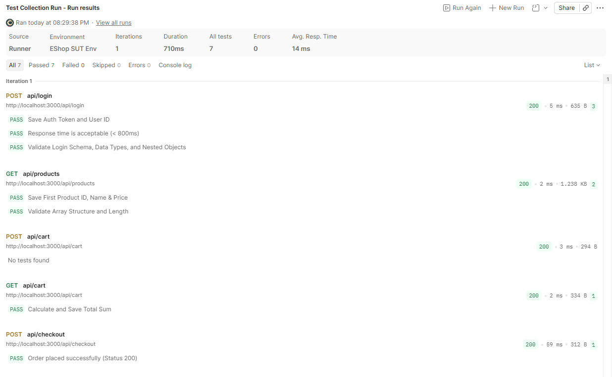


#### Exporting Collections & Environments
To execute your tests from the command line via Newman, you must first export your collection and environment configurations:
- **Export Collection**: Click the ellipsis button (`...`) next to your Collection name → **More** → select **Export collection** → save as a `.json` file (e.g., `EShop_API_Collection.json`).
- **Export Environment**: Select the **Environments** tab in the left sidebar → click the ellipsis button (`...`) next to your environment (e.g., `"EShop Env"`) → select **Export** → save as a `.json` file (e.g., `EShop_Environment.json`).


#### Newman CLI
Newman is a command-line collection runner for Postman. It allows you to run and test Postman collections directly from the command line, making it perfect for integration with CI/CD pipelines.

1. **Running Collections**: Execute the run command by passing your exported collection and environment files. For example, to run the EShop collection:
   ```bash
   newman run "EShop_API_Collection.json" -e "EShop_Environment.json"
   ```
2. **Generating Reports**: Newman supports multiple reporting formats to save your test results. For example, to run and export reports for the EShop collection:
   - **CLI (Terminal Table)**: Included by default.
   - **HTML Report**: Generates a detailed HTML report file that can be opened in any web browser.
     ```bash
     newman run "EShop_API_Collection.json" -e "EShop_Environment.json" -r cli,html --reporter-html-export "report.html"
     ```
     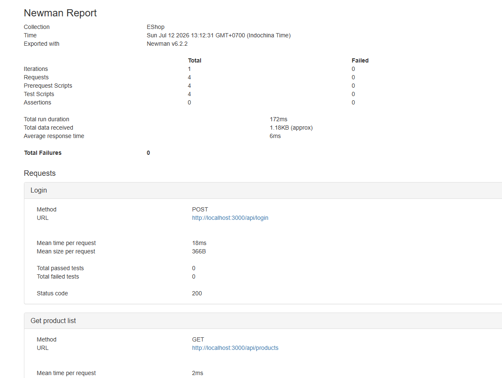

   - **JSON Report**: Useful for programmatically parsing test results.
     ```bash
     newman run "EShop_API_Collection.json" -e "EShop_Environment.json" -r cli,json --reporter-json-export "results.json"
     ```
   - **JUnit XML Report**: Standard format widely supported by CI/CD build tools.
     ```bash
     newman run "EShop_API_Collection.json" -e "EShop_Environment.json" -r cli,junit --reporter-junit-export "results.xml"
     ```

#### Report formats & Metrics
Below is a comparison of the available report formats:

| Format | Description | Key Metrics to Inspect |
|--------|-------------|-------------------------|
| **CLI** | Displayed directly on terminal. | Summary tables showing passed/failed checks. |
| **HTML** | Rich visualization page opened in browser. | Total assertions, average response time, and detailed request failures. |
| **JSON** | Raw test result data. | Structured metrics for script parsing. |
| **JUnit XML** | Standard CI-ready XML format. | Compatibility metrics for CI/CD dashboards (e.g. Jenkins). |

#### Data-Driven Testing
Data-driven testing allows you to run a single request (or the entire flow) multiple times with different sets of test data provided by an external file (CSV or JSON).

**Example Scenario**: We want to test the `POST /api/login` endpoint with 5 different credentials combinations to verify both successful logins (200 OK) and negative validation cases (e.g., missing credentials or wrong password).

1. **Prepare the Data File (`login_data.csv`)**:
   Create a CSV file with headers mapping to variables used in your requests. Each row represents a single iteration:
   ```csv
   email,password,expected_status
   test@eshop.com,Test1234!,200
   bob@eshop.com,Password456!,200
   test@eshop.com,wrong_password,401
   (empty),Test1234!,400
   charlie@eshop.com,(empty),400
   ```
2. **Accessing Iteration Data in Test Scripts**:
   Modify your tests to retrieve values dynamically from the iteration data using `pm.iterationData.get("column_name")`. The script automatically verifies whether the actual HTTP status matches the `expected_status` value for that row:
   ```javascript
   const expectedStatus = pm.iterationData.get("expected_status");

   pm.test("Status code is " + expectedStatus, function () {
       pm.response.to.have.status(parseInt(expectedStatus));
   });
   ```

3. **Running Iterations in Collection Runner**: There are 2 ways to feed test data **(Both require an Enterprise account)**:
   - **Method 1: Using a Test Data File**:
     - In the Collection Runner configuration, look for the **Test data file** section.
     - Click **Select File** and upload the data file directly (e.g., `login_data.csv`).
     - Postman will automatically set the number of **Iterations** to match the rows in the file and run them sequentially.

        

   - **Method 2: Using Datasets & Data Views**:
     - **Create a Dataset**: Click the plus (`+`) icon next to the **Datasets** section in the Collection Runner configuration to create a new dataset and name it (e.g., `Test login dataset`).

       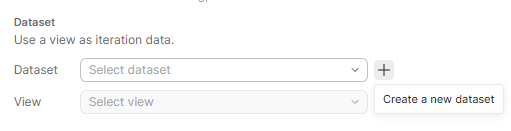

     - **Add Data Sources**: In the **Data source(s)** section, select your data source type (e.g., choose **Local File** to drag-and-drop or upload your `.csv` file), then click **Add source** to add a new data source (e.g., `source_login_data`).
     - **Create Data Views**: Postman will automatically generate a default view (e.g., `source_login_data_default_view`). You can click **Create view** to add custom views to filter your data as desired.

       

     - **Configure the Runner**: In the Collection Runner configuration, choose the data source as **Dataset** and select the correct **Data view** you just created to use as the input test data.

        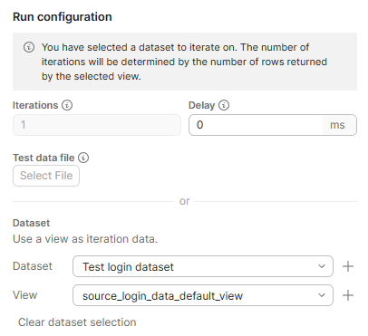
     

4. **Running Iterations in Newman**:
   Run the test suite using the `--iteration-data` (or shorthand `-d`) and `--folder` flag (only if you want to run a sub folder or a specific api) and specify the data file. For example, running the EShop login iteration tests:
   ```bash
   newman run "EShop_API_Collection.json" --folder "api/login" -e "EShop_Environment.json" -d "login_data.csv" --iteration-count 5
   ```


### 5.3 — Postbot: AI-Generated Tests

#### 5.3.1. What is Postbot?

Postbot is Postman's built-in AI feature that automatically generates test scripts (assertions) based on a request's response. Instead of a tester manually writing every `pm.test(...)` block, Postbot can analyze the returned data structure and propose corresponding checks.

**How to access it:** After sending a request and receiving a response, go to the **Tests** tab → click **"Ask Postbot"** → either pick a built-in suggestion (e.g. "Test for response") or type a custom instruction directly into the chat box.

#### 5.3.2. Basic Workflow

1. Send the request to get a sample response
2. Go to the Tests tab → click Ask Postbot
3. Choose a default suggestion or type a custom prompt
4. Review the generated code and check whether it makes sense
5. Send the request again to run the tests and see PASS/FAIL results
6. Keep it if it's appropriate, or edit it if needed

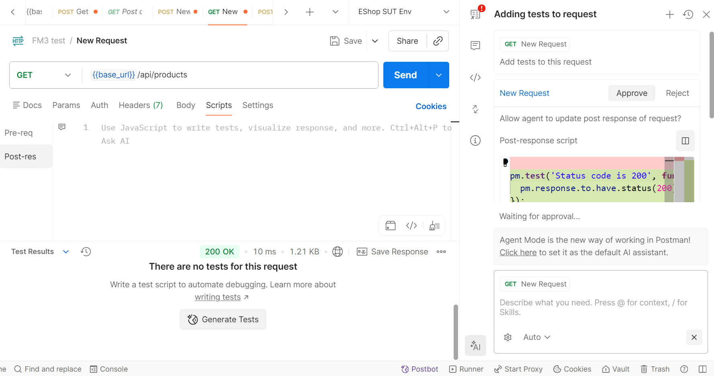
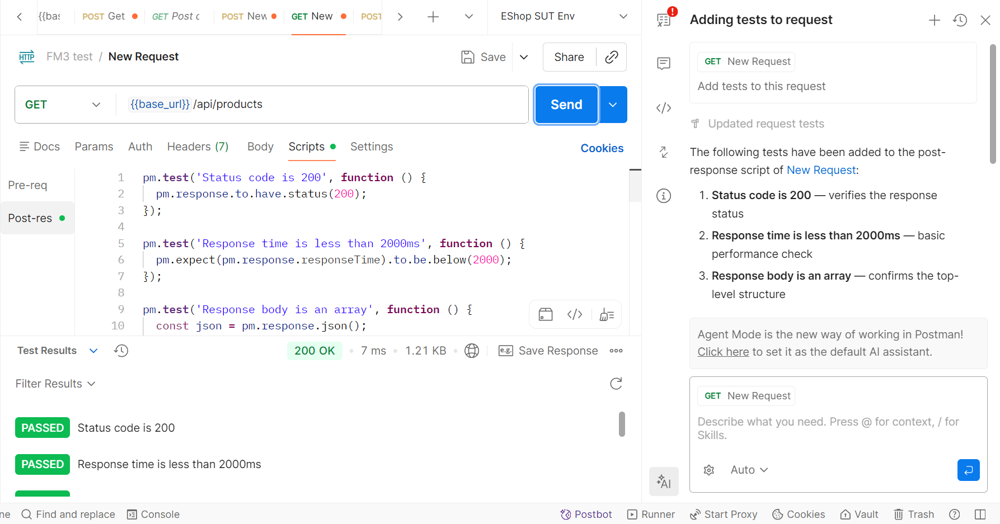
#### 5.3.3. Custom Prompts — Guiding Postbot with Specific Instructions

In default mode, Postbot only looks at one sample response to guess what to test — this has significant limitations (see 5.3.6). Users can type a specific instruction directly into the chat to "teach" Postbot the correct business logic, for example:

> *"Write a test that calculates the expected discount as total_amount \* 10 / 100 for a percent coupon, and asserts discount_amount matches this calculation exactly."*

When given a clear formula like this, Postbot can write tests that check the actual numbers, instead of only checking generic data types.

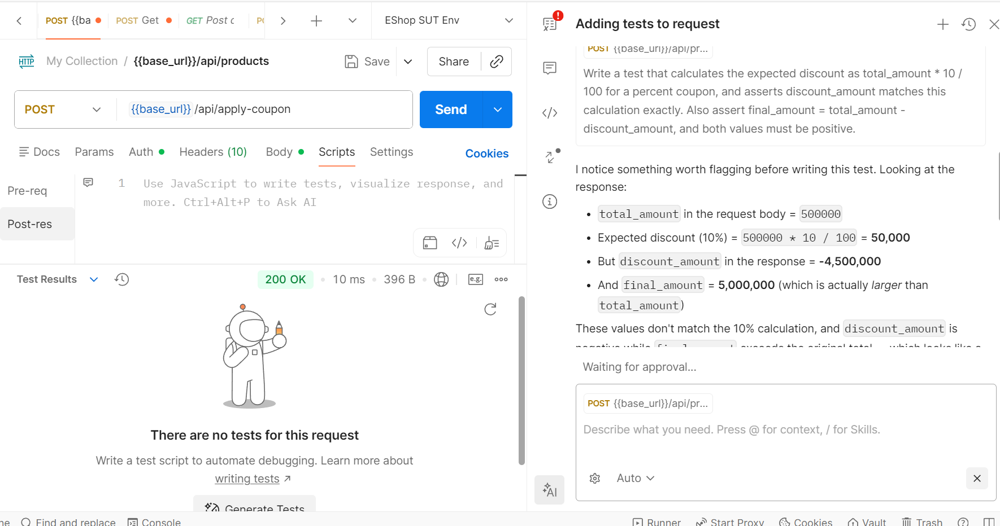
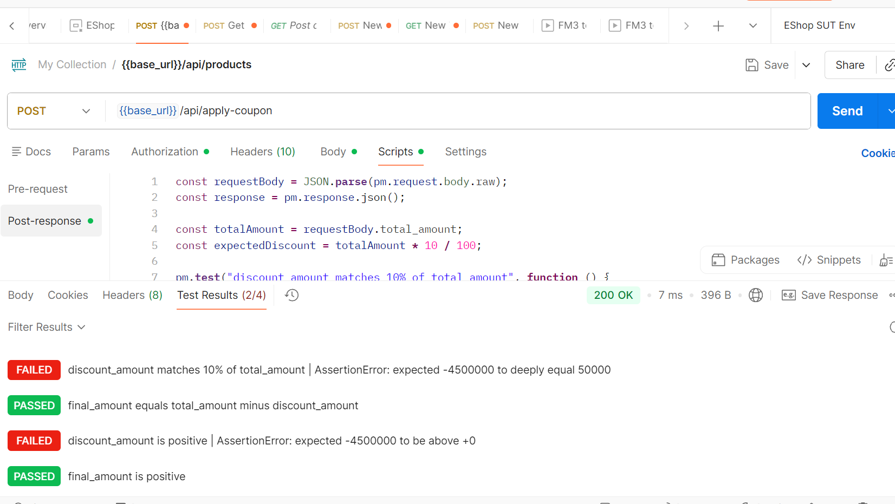

#### 5.3.4. Postbot vs. Manual Tests — Real Experiment Data on EShop SUT

Tested on the `POST /api/apply-coupon` endpoint using the system's 4 built-in coupon codes (SAVE10, BIGBUY, VIP100, EXPIRED) across several scenarios:

| Test Case | Manual | Postbot | Notes |
|---|---|---|---|
| Valid coupon → 200 | ✅ | ⚠️ Passes but misses the data bug (default mode) | Response returns 200 but `discount_amount = -4,500,000` (incorrect) |
| Invalid coupon → error | ✅ | ✅ Passes, but only checks "an error field exists as a string," not whether the content matches the context | |
| Expired coupon → error | ✅ | ✅ Same as above | |
| Below minimum order → error | ✅ | ✅ Same as above | |
| Max uses exceeded → error | ✅ (clearly caught the bug) | ❌ Postbot is "fooled" | See section 6.2 |
| Discount formula is correct | ✅ (clearly caught the bug) | ❌ default / ✅ with custom prompt | |
| Edge case: total_amount = 0 | ✅ (system handles it correctly, not a bug) | Not yet needed | |

#### 5.3.5. What Postbot Does Well

- Quickly generates basic structural tests: status code, response time, Content-Type, data types (`number`, `string`), field existence.
- For error responses (4xx), Postbot can still write a separate branch (`if (statusCode === 400) {...}`), showing reasonably good branching by status code.
- Saves significant time on writing boilerplate tests compared to doing everything manually.

#### 5.3.6. Where Postbot Falls Short

- **Doesn't cross-check business rules:** in default mode, Postbot only infers tests from a single sample response. If that response contains a bug (e.g. an incorrect percentage calculation), Postbot will write a test confirming the wrong value as "correct" instead of catching the bug.
- **Error-case tests stay superficial:** even though it can generate a branch for error handling, Postbot only checks "an error field exists, is a non-empty string" — it doesn't distinguish whether the error content actually matches the specific context (expired / not found / below threshold).
- **Can't test stateful business rules:** Postbot only analyzes one request-response at a time and has no concept of prior call history. In the "exceeded usage limit" case, because the response (due to a system bug) still returned success, Postbot had no way of knowing this should have been rejected.
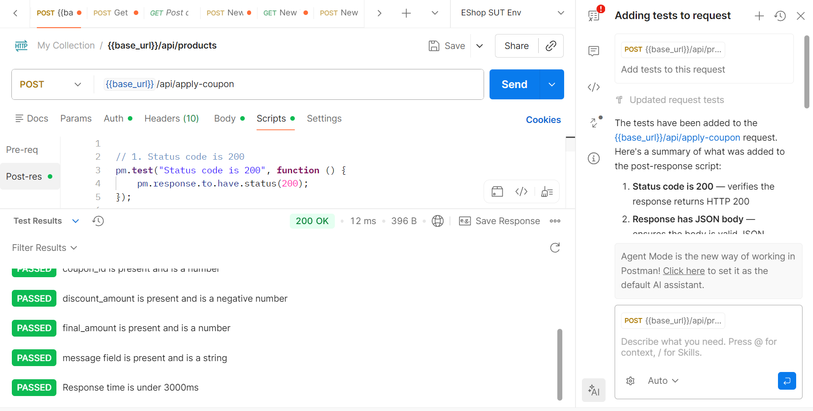
#### 5.3.7. Free Tier Limitations

- 50 AI credits/month; each Postbot interaction uses 1 credit.
- Requires an actual response (the request must already have been sent) before Postbot can generate tests.

#### 5.3.8. Conclusion

Postbot is a solid tool for quickly writing structural tests (schema, data types, status codes), but it cannot replace human testing judgment when it comes to cross-checking business logic or verifying stateful constraints. The most effective approach is to combine both: use Postbot to quickly generate basic structural tests, then manually add or fix assertions related to business logic based on the system's specification.

---

## Section 6: Failure Modes

This section presents 3 systemic "failure modes" identified through hands-on testing of Postbot on the EShop SUT system, primarily via the `POST /api/apply-coupon` endpoint.

---

## 6.1. FM1 — Anchoring on a Buggy Sample Response ("Learning the Bug Instead of Catching It")

**Description:**
In default mode (no additional guidance), Postbot only looks at the one sample response currently displayed to infer its assertions. If that sample response contains a bug, Postbot will write a test that **confirms the bug as correct behavior**, instead of cross-checking it against actual business logic.

**Concrete example (from real testing):**
For `POST /api/apply-coupon`, body `{ "code": "SAVE10", "total_amount": 500000, "user_id": 1 }`, the system returned:
```json
{
  "success": true,
  "coupon_id": 1,
  "discount_amount": -4500000,
  "final_amount": 5000000,
  "message": "Áp dụng thành công! Giảm 10%"
}
```
Per the specification (a 10% percent coupon on a total of 500,000₫), `discount_amount` should be **50,000** (positive), not **-4,500,000**. Yet Postbot, in default mode, generated this assertion:
```javascript
pm.test("Discount amount is negative (a reduction)", function () {
    pm.expect(jsonData.discount_amount).to.be.below(0);
});
```
— meaning Postbot treated the negative `discount_amount` as the correct expected behavior, when in fact it's a serious calculation bug.

**Consequence:**
All 8/8 tests Postbot generated passed (green), giving the impression the API works perfectly fine, while the discount calculation is actually completely wrong — in production this could cause customers to be charged incorrect amounts. Worse, if the backend is later fixed correctly (so `discount_amount` becomes positive), this same test suite would **wrongly fail** on a correct fix.

**Prevention:**
- Don't blindly trust tests Postbot generates in default mode, especially for fields involving numerical calculations (money, quantities, ratios).
- Know the correct business formula in advance (from the specification) and provide it via a **custom prompt** so Postbot can cross-check against it, instead of letting it guess from a single sample. Example effective prompt:
  > *"Assert that discount_amount equals total_amount × 10 / 100 exactly, and must be a positive number."*
- Always keep at least one manually written test based on the known-correct formula, independent of Postbot, as a cross-check.

---

## 6.2. FM2 — Happy-Path Only / Superficial Error-Case Tests

**Description:**
Postbot can generate a separate branch for error responses (based on status code), but these assertions only check **surface-level structure** — that an error field exists, is a string, is non-empty — without checking whether **the error content actually matches the specific business context**. In addition, Postbot cannot test constraints that depend on **state/history** (stateful business rules), since it only analyzes one request-response at a time.

**Concrete example — superficial error tests:**
Three genuinely different error scenarios were tested on the same endpoint:

| Scenario | Actual Response | Assertion Postbot Generated |
|---|---|---|
| Expired coupon (`EXPIRED`) | `{"error": "Mã giảm giá đã hết hạn"}` | `expect(error).to.be.a('string').and.not.empty` |
| Nonexistent coupon (`FAKE99`) | `{"error": "Mã giảm giá không tồn tại..."}` | `expect(error).to.be.a('string')` |
| Below minimum order (`BIGBUY`, low total) | `{"error": "Đơn hàng chưa đủ giá trị tối thiểu..."}` | `expect(jsonData).to.have.property("error")` |

All three assertions are **essentially identical** — they only confirm "there's an error string" — even though the three failure causes are completely different in nature (expired / nonexistent / below threshold).

**Concrete example — failing to catch a stateful bug:**
The EShop SUT system has a bug: it doesn't check the per-user usage limit on coupons (`SAVE10` is limited to 1 use/person per spec, but sending the exact same request a second time is still accepted with `success: true`). Because the response looked identical to a normal successful case, Postbot generated 8/9 passing tests, completely failing to recognize this was a case that should have been rejected — since it has no concept of "has this coupon already been used before."

**Consequence:**
If the backend has a logic bug (e.g. accidentally swapping the "expired" message with the "not found" message), or if a stateful constraint is missing (like the usage limit), the test suite Postbot generates **still passes normally**, with no ability to detect it.

**Prevention:**
- For each error branch, manually add assertions that check the **specific error message or error code** matching the actual cause, not just the data type.
- For stateful constraints (usage limits, operation order, etc.), design a sequential multi-request test scenario (call twice, verify the second call is rejected) — this is beyond Postbot's capability and must be designed by the tester.
- Refer to the Negative Testing section (5.1b) for a more complete approach to designing negative test cases, not relying on Postbot alone.

---

## 6.3. FM3 — Collection Runner Hides the Root Cause

**Description:**
When running requests through the Collection Runner, error messages shown are usually limited to a status code and a generic assertion message, without explaining the root cause. More notably: the Collection Runner has an environment selector that is **independent** from the environment dropdown on the main Postman screen — if the correct environment isn't selected inside the Runner window itself, all variables (`{{auth_token}}`, `{{base_url}}`...) will fail to resolve when sending the request, causing the request to actually be malformed while the Runner gives no warning about this.

**Concrete example (from real testing):**
Created a collection "FM3 test" containing `GET /api/cart` (with a test `pm.response.to.have.status(200)`) and `POST /api/apply-coupon`, and ran it via Collection Runner. The Runner displayed:
```
FAIL  Status code is 200 | AssertionError: expected response to have status code 200 but got 403
```
Looking at this line alone, it's easy to wrongly assume the cause is an expired token, insufficient permissions, or a backend bug. Opening the Console (Ctrl+Alt+C) to inspect the actual request sent revealed the header:
```
Authorization: Bearer {{auth_token}}
```
— meaning the `{{auth_token}}` variable was **never substituted with an actual value**; Postman sent the literal placeholder string as-is. The real cause was that the Collection Runner was running with the wrong (or no) environment selected, independent of the environment chosen on the main screen — not anything related to whether the token itself was valid or expired.

**Consequence:**
Testers can easily misattribute the error to an authentication/authorization issue on the backend, wasting time debugging in the wrong direction (re-checking backend logic, generating a new token...) when the real cause is simply a misconfigured environment selection in the Runner — a tester-side configuration mistake, not a system bug.

**Prevention:**
- Before clicking Run in the Collection Runner, always check the environment dropdown **inside the Runner window itself** — don't assume it automatically uses whatever environment is selected on the main screen.
- When encountering a confusing error in the Runner (unusual status code, malformed URL), always open the Console (Ctrl+Alt+C) to inspect the actual request headers/URL/body sent before concluding the cause.
- Warning sign that a variable failed to resolve: request headers or URLs still display the literal `{{variable_name}}` syntax instead of an actual value.

---

## Overall Summary

All three failure modes above point to one common theme: Postbot (and AI-generated tests in general) performs well at the level of **data structure** (types, field existence, status codes) but cannot independently reason about **business logic** or **stateful/historical context**. The tester's role remains irreplaceable: understanding the specification, knowing the expected correct behavior in advance, and actively verifying rather than blindly trusting AI output.

---

## Section 7: Troubleshooting

This section covers the most common errors you will encounter when working with Postman, Postbot, and Newman — along with their causes and solutions.

### 7.1 — `ECONNREFUSED` — Cannot Connect to Server

**Symptom:** When sending a request, Postman (or Newman) returns an error similar to:
```
Error: connect ECONNREFUSED 127.0.0.1:3000
```

**Cause:** The target server (e.g., EShop SUT) is not running, or the `base_url` environment variable points to the wrong host/port.

**Solution:**
1. Verify that the EShop SUT server is running.
2. Check your Environment variables — ensure `base_url` is set correctly (e.g., `http://localhost:3000`).
3. Confirm the port number matches the server's actual listening port (check the server's terminal output for messages like `Server running on port 3000`).
4. If the server runs on a different machine or inside a Docker container, replace `localhost` with the correct hostname or IP address.

---

### 7.2 — `{{auth_token}}` is Undefined — Variable Not Set

**Symptom:** Requests to protected endpoints fail with `401 Unauthorized`, and hovering over `{{auth_token}}` in Postman shows it as **unresolved** or **undefined**.

**Cause:** The authentication token was never saved to the environment. This typically happens when:
- You forgot to run the Login request before accessing protected endpoints.
- The Login request's Post-response script that saves the token is missing or has a bug.
- You ran requests out of order in the Collection Runner (e.g., skipped the Login step).

**Solution:**
1. **Run the Login request first.** Ensure `POST /api/login` is executed before any request that requires authentication.
2. **Verify the Post-response script** on the Login request saves the token correctly:
   ```javascript
   const responseData = pm.response.json();
   if (pm.response.code === 200 && responseData.token) {
       pm.environment.set("auth_token", responseData.token);
   }
   ```
3. **Check the Environment** — after running Login, click the "eye" icon (Environment Quick Look) in the top-right corner to confirm that `auth_token` has a **Current Value**.
4. **In Collection Runner**, ensure the Login request is positioned at the top of the execution order so it runs first.

---

### 7.3 — Postbot Does Not Show the "Ask Postbot" Button

**Symptom:** You open the Scripts (Tests) tab on a request, but the Postbot option or "Ask Postbot" button is not visible.

**Cause:** Postbot requires a **response sample** to generate test assertions — it analyzes the actual response body to produce relevant tests. If you have not sent the request yet, Postbot has no data to work with. Additionally, your AI credits may be exhausted.

**Solution:**
1. **Send the request first** — click **Send** to execute the request and receive a response. Once the response appears, Postbot's option should become available.
2. **Check your AI credits** — go to your Postman account settings or the billing page to verify that you still have available AI credits. The Free plan provides **50 credits/month**; each Postbot generation consumes approximately 1 credit.
3. **Ensure you are signed in** — Postbot requires an authenticated Postman account. If you are using Postman without signing in, Postbot features will not be available.

---

### 7.4 — Newman Reports `collection could not be loaded` or `collection not found`

**Symptom:** Running Newman from the command line produces an error like:
```
error: collection could not be loaded
  unable to read data from file "EShop_API_Collection.json"
```

**Cause:** The file path to the exported Collection JSON is incorrect, the file does not exist at the specified location, or you forgot to export the Collection from Postman.

**Solution:**
1. **Verify the file path** — ensure the `.json` file exists in the directory where you are running the Newman command. Use `ls` (macOS/Linux) or `dir` (Windows) to list files:
   ```bash
   # macOS/Linux
   ls -la *.json

   # Windows (PowerShell)
   dir *.json
   ```
2. **Use the correct file name** — double-check for typos in the file name (case-sensitive on macOS/Linux).
3. **Export the Collection** if you have not already:
   - In Postman, click the ellipsis (`...`) next to your Collection → **Export** → save as `.json`.
4. **Use absolute paths** if the file is in a different directory:
   ```bash
   newman run "C:/Users/admin/exports/EShop_API_Collection.json" -e "C:/Users/admin/exports/EShop_Environment.json"
   ```

---

### 7.5 — Assertion Fails with No Clear Reason — Use Postman Console

**Symptom:** A test assertion fails (red FAIL badge), but the error message is generic or does not clearly explain what went wrong. For example:
```
AssertionError: expected undefined to be a number
```

**Cause:** The response body may have a different structure than expected (e.g., a field is missing, nested differently, or the endpoint returned an error response instead of the expected data). Without logging, it is difficult to see the actual response content that caused the failure.

**Solution:**
1. **Open the Postman Console** — press `Ctrl + Alt + C` (Windows/Linux) or `Cmd + Alt + C` (macOS) to open the Console panel. The Console displays detailed logs for every request/response, including headers, body, and any `console.log()` output from your scripts.
2. **Add `console.log()` statements** to your test scripts to inspect the actual response data:
   ```javascript
   const responseData = pm.response.json();
   console.log("Response body:", JSON.stringify(responseData, null, 2));
   console.log("Status code:", pm.response.code);

   pm.test("Product has an id field", function () {
       pm.expect(responseData).to.have.property('id').that.is.a('number');
   });
   ```
3. **Re-run the request** and check the Console output to see the exact response body. This will reveal whether the field exists, is named differently, or if the API returned an error response.
4. **Common root causes:**
   - The API returned an error object (e.g., `{ "error": "Unauthorized" }`) instead of the expected data — your script tried to access a field that only exists in successful responses.
   - A field name is different from what you expected (e.g., `product_id` vs. `productId`).
   - The response is an array, but your script treats it as an object (or vice versa).

---

### 7.6 — Newman HTML Report Does Not Generate

**Symptom:** Running Newman with the `-r html` reporter flag does not produce an HTML file, or Newman throws an error like:
```
error: reporter "html" could not be loaded
```

**Cause:** The `newman-reporter-html` package is not installed. Unlike the CLI reporter (which is built-in), the HTML reporter is a separate npm package that must be installed globally.

**Solution:**
1. **Install the HTML reporter globally:**
   ```bash
   npm install -g newman-reporter-html
   ```
2. **Re-run your Newman command** with the HTML reporter:
   ```bash
   newman run "EShop_API_Collection.json" -e "EShop_Environment.json" -r cli,html --reporter-html-export "report.html"
   ```
3. **Verify the output** — after a successful run, the `report.html` file will be created in the current directory. Open it in any web browser to view the detailed test report.
4. **If the issue persists**, check your npm global installation path:
   ```bash
   npm list -g --depth=0
   ```
   Ensure both `newman` and `newman-reporter-html` appear in the list. If not, re-install them.

---

## Section 8: References

### Official Documentation

| Resource | Link |
|----------|------|
| Postman Learning Center | [https://learning.postman.com](https://learning.postman.com) |
| Postman Test Script Examples | [https://learning.postman.com/docs/tests-and-scripts/write-scripts/test-examples/](https://learning.postman.com/docs/tests-and-scripts/write-scripts/test-examples/) |
| Postman Sandbox API Reference (`pm.*`) | [https://learning.postman.com/docs/tests-and-scripts/write-scripts/postman-sandbox-reference/overview/](https://learning.postman.com/docs/tests-and-scripts/write-scripts/postman-sandbox-reference/overview/) |
| Postman AI Features (Postbot) | [https://learning.postman.com/docs/getting-started/basics/about-ai/](https://learning.postman.com/docs/getting-started/basics/about-ai/) |
| Newman CLI — GitHub | [https://github.com/postmanlabs/newman](https://github.com/postmanlabs/newman) |
| Newman HTML Reporter — GitHub | [https://github.com/postmanlabs/newman-reporter-html](https://github.com/postmanlabs/newman-reporter-html) |

### Tools & Downloads

| Tool | Link |
|------|------|
| Postman Desktop App | [https://www.postman.com/downloads/](https://www.postman.com/downloads/) |
| Node.js (includes npm) | [https://nodejs.org/](https://nodejs.org/) |

### Contract Testing & Standards

| Resource | Link |
|----------|------|
| JSON Schema (draft-07) | [https://json-schema.org/](https://json-schema.org/) |
| Pact — Consumer-Driven Contract Testing | [https://pact.io](https://pact.io) |
| PactFlow — What is CDC? | [https://pactflow.io/what-is-consumer-driven-contract-testing/](https://pactflow.io/what-is-consumer-driven-contract-testing/) |
| Postman Mock Servers | [https://learning.postman.com/docs/design-apis/mock-apis/set-up-mock-servers/](https://learning.postman.com/docs/design-apis/mock-apis/set-up-mock-servers/) |

