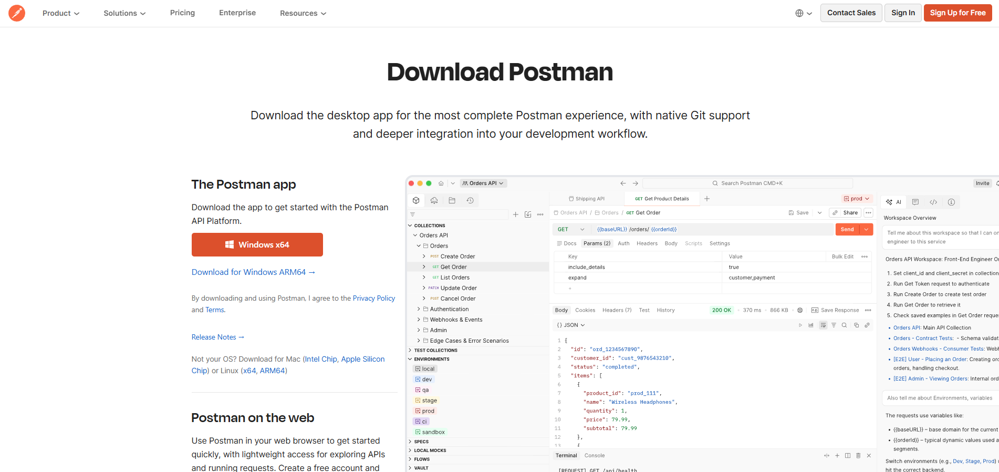
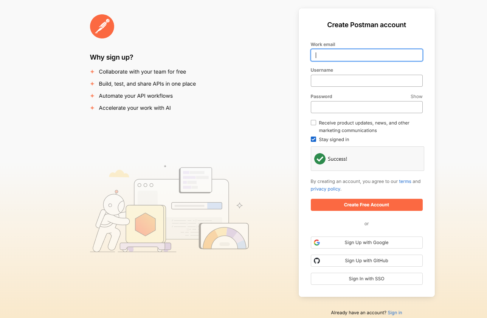
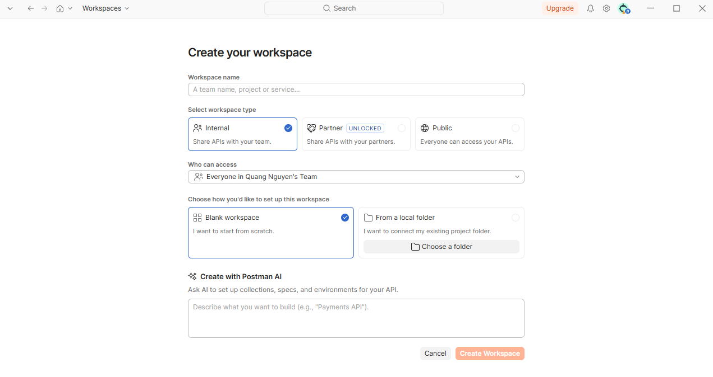
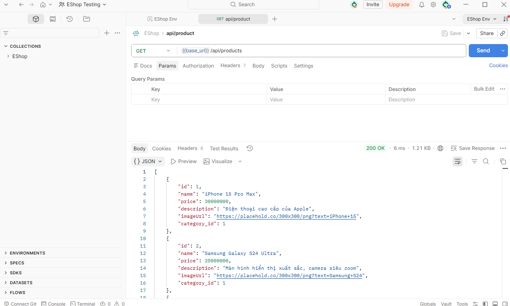
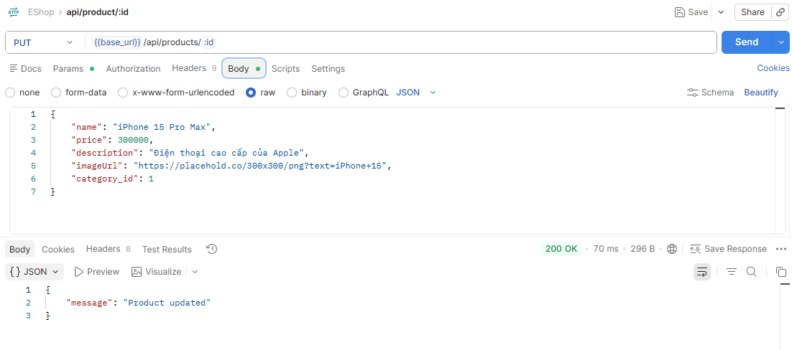
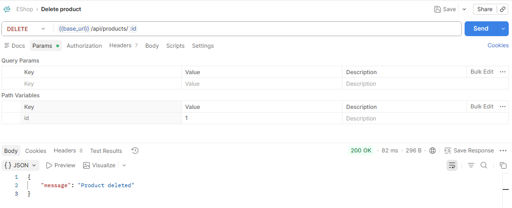
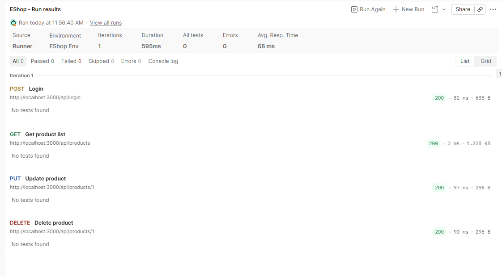
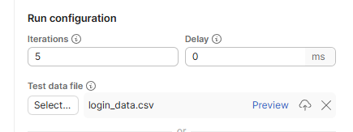
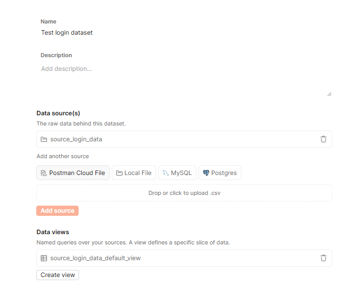

# User Guide: API Contract Testing with Postman & Postbot

## Section 1: Introduction

---

## Section 2: Install & Setup

### Installation

1. **Postman Desktop App** — Download from https://www.postman.com/downloads/ (Windows/macOS/Linux)

   
2. **Create a Free Account** — 1 user, 50 AI credits/month (sufficient for Postbot)

   
3. **Newman CLI** — Requires Node.js & npm. Install via terminal:
   - Check if Node.js and npm are already installed by running:
     ```bash
     node -v
     npm -v
     ```
   - If not installed, download and install Node.js (which includes npm) from https://nodejs.org/.
   - Once Node.js & npm are verified, install Newman and the HTML reporter:
     ```bash
     npm install -g newman
     npm install -g newman-reporter-html
     ```

### Setup Environment in Postman

1. **Open/Create a Workspace**:
   - In the top-left corner of Postman, click **Workspaces**.
   - Select an existing workspace, or click **Create Workspace** to create a new workspace for your project (e.g., named "EShop Testing" for the EShop project).

     

     - Choose the appropriate **Visibility** type depending on your needs:
       - **Internal**: Only accessible by you (best for solo testing).
       - **Partner**: Shared with invited team members (best for group collaboration).
       - **Public**: Visible to anyone on the internet (used for publishing API docs).
2. **Create a new Environment**: Click the plus button (`+`) at the top of the left sidebar → select **Environment** → name it according to your project environment (e.g., "EShop Env").

   
3. **Add variables**: Add the required environment variables to store configuration values (such as URL, authentication credentials, dynamic parameters). Below is an example of configuration variables for the **EShop** system under test (SUT):

| Variable | Initial Value | Description |
|----------|--------------|-------------|
| `base_url` | `http://localhost:3000` | URL of EShop SUT |
| `username` | `test@eshop.com` | Test user |
| `password` | `Test1234!` | Test password |
| `auth_token` | *(leave empty)* | Authentication token (JWT) |
| `product_id` | *(leave empty)* | Product ID for testing |

4. **Select the Environment**: Choose the newly created environment (e.g., "EShop Env") from the environment dropdown in the top-right corner of Postman to apply the variables.

   

5. **Import Collection**: Import your project's API Collection (e.g., the exported `.json` file of EShop API). Click the **Import** button in the left sidebar (or click the ellipsis `...` next to the collection section header) → select the `.json` collection file.

   

### Verify Connection

To verify that the setup is successful and the environment variables are active:
- Select a simple test endpoint in your collection (e.g., `GET {{base_url}}/api/products` in EShop).
- Click **Send**.
- If you receive a JSON response with status code `200 OK` (or other expected successful status), the connection is verified and successful.

  

---

## Section 3: First Test — Basic API Requests

### 4 Basic HTTP Methods

1. **GET `/api/products`** — Retrieve the list of products from SUT.
   - **Request Body**: None
   - **Response**: List of products in JSON format.
   

2. **POST `/api/login`** — Login and receive the JWT authentication token.
   - **Request Body**: `{ "email": "...", "password": "..." }`
   - **Response**: JSON containing the token.
   

3. **PUT `/api/products/:id`** — Update a product's details.
   - **Path Variables**: Set the target `id` value under the **Params** tab.
   - **Request Body**:
    ```json
    { 
        "name": "Tên sản phẩm",
        "price": 100000,
        "description": "Mô tả",
        "imageUrl": "http://...",
        "category_id": 1
    }
    ```
   - **Response**: The updated product JSON.
   

4. **DELETE `/api/products/:id`** — Delete a product by its ID.
   - **Path Variables**: Set the target `id` value under the **Params** tab.
   - **Request Body**: None
   - **Response**: Status confirmation.
   


### Common HTTP Status Codes

| Code | Meaning | Occurrences |
|------|---------|-------------|
| **200** OK | Success | Successful GET or PUT request |
| **201** Created | Created | Successful POST request creating a resource |
| **400** Bad Request | Bad Input | Missing fields or invalid data types |
| **401** Unauthorized | Unauthenticated | Missing or invalid token |
| **403** Forbidden | Unauthorized | Valid token but lack of permissions |
| **404** Not Found | Not Found | Resource does not exist |
| **409** Conflict | Conflict | E.g., coupon has already been redeemed |
| **500** Internal Server Error | Server Error | Bug on the server-side |

### Authorization Tab in Postman

1. Open your Collection (or folder) → click the **Authorization** tab.
2. Select **Type**: `Bearer Token` → set **Token**: `{{auth_token}}`.
3. All child requests in this Collection will automatically inherit the `Authorization: Bearer <token>` header.
4. No need to manually set the Authorization header for each individual request.

---

## Section 4: API Authentication Testing Patterns


---

## Section 5: Advanced Usage

### 5.1a — Test Scripts


### 5.1b — Negative Testing & Error Handling


### 5.2 — Collection Runner & Newman CLI

#### Collection Runner (GUI)
The Collection Runner allows you to run your entire Postman Collection in a specified sequence. This is essential for testing a complete integration workflow (for example, the E-commerce integration flow: Login → Retrieve Products → Add to Cart → Place Order) to ensure variable chaining works seamlessly as an end-to-end integration test instead of isolated request executions.

1. **Open the Runner**: Right-click your collection in the left sidebar (e.g., **EShop API Collection**) and select **Run**.
2. **Configure Run Settings**:
   - **Functional/Manual**: Select the requests you want to include in the run (uncheck any requests you wish to skip).
   - **Iterations**: Set the number of times the Collection should run (default is `1`).
   - **Delay**: Add a delay (in milliseconds) between request executions to prevent rate-limiting or overloading the SUT.
3. **Run the Collection**: Ensure the target environment (e.g., `"EShop Env"`) is active, then click the **Run <Collection Name>** button (e.g., **Run EShop API Collection**).
4. **Analyze Results**: Postman displays a real-time summary of the run. You can view the status of each request and inspect the assertion pass/fail details.
   


#### Exporting Collections & Environments
To execute your tests from the command line via Newman, you must first export your collection and environment configurations:
- **Export Collection**: Click the ellipsis button (`...`) next to your Collection name → **More** → select **Export collection** → save as a `.json` file (e.g., `EShop_API_Collection.json`).
- **Export Environment**: Select the **Environments** tab in the left sidebar → click the ellipsis button (`...`) next to your environment (e.g., `"EShop Env"`) → select **Export** → save as a `.json` file (e.g., `EShop_Environment.json`).


#### Newman CLI
Newman is a command-line collection runner for Postman. It allows you to run and test Postman collections directly from the command line, making it perfect for integration with CI/CD pipelines.

1. **Running Collections**: Execute the run command by passing your exported collection and environment files. For example, to run the EShop collection:
   ```bash
   newman run "EShop_API_Collection.json" -e "EShop_Environment.json"
   ```
2. **Generating Reports**: Newman supports multiple reporting formats to save your test results. For example, to run and export reports for the EShop collection:
   - **CLI (Terminal Table)**: Included by default.
   - **HTML Report**: Generates a detailed HTML report file that can be opened in any web browser.
     ```bash
     newman run "EShop_API_Collection.json" -e "EShop_Environment.json" -r cli,html --reporter-html-export "report.html"
     ```
     

   - **JSON Report**: Useful for programmatically parsing test results.
     ```bash
     newman run "EShop_API_Collection.json" -e "EShop_Environment.json" -r cli,json --reporter-json-export "results.json"
     ```
   - **JUnit XML Report**: Standard format widely supported by CI/CD build tools.
     ```bash
     newman run "EShop_API_Collection.json" -e "EShop_Environment.json" -r cli,junit --reporter-junit-export "results.xml"
     ```

#### Report formats & Metrics
Below is a comparison of the available report formats:

| Format | Description | Key Metrics to Inspect |
|--------|-------------|-------------------------|
| **CLI** | Displayed directly on terminal. | Summary tables showing passed/failed checks. |
| **HTML** | Rich visualization page opened in browser. | Total assertions, average response time, and detailed request failures. |
| **JSON** | Raw test result data. | Structured metrics for script parsing. |
| **JUnit XML** | Standard CI-ready XML format. | Compatibility metrics for CI/CD dashboards (e.g. Jenkins). |

#### Data-Driven Testing
Data-driven testing allows you to run a single request (or the entire flow) multiple times with different sets of test data provided by an external file (CSV or JSON).

**Example Scenario**: We want to test the `POST /api/login` endpoint with 5 different credentials combinations to verify both successful logins (200 OK) and negative validation cases (e.g., missing credentials or wrong password).

1. **Prepare the Data File (`login_data.csv`)**:
   Create a CSV file with headers mapping to variables used in your requests. Each row represents a single iteration:
   ```csv
   username,password,expected_status
   test@eshop.com,Test1234!,200
   bob@eshop.com,Password456!,200
   test@eshop.com,wrong_password,401
   (empty),Test1234!,400
   charlie@eshop.com,(empty),400
   ```
2. **Accessing Iteration Data in Test Scripts**:
   Modify your tests to retrieve values dynamically from the iteration data using `pm.iterationData.get("column_name")`. The script automatically verifies whether the actual HTTP status matches the `expected_status` value for that row:
   ```javascript
   const expectedStatus = pm.iterationData.get("expected_status");

   pm.test("Status code is " + expectedStatus, function () {
       pm.response.to.have.status(parseInt(expectedStatus));
   });
   ```

3. **Running Iterations in Collection Runner**: There are 2 ways to feed test data:
   - **Method 1: Using a Test Data File (Requires an Enterprise account)**:
     - In the Collection Runner configuration, look for the **Test data file** section.
     - Click **Select File** and upload the data file directly (e.g., `login_data.csv`).
     - Postman will automatically set the number of **Iterations** to match the rows in the file and run them sequentially.

        

   - **Method 2: Using Datasets & Data Views (Free for all account types)**:
     - **Create a Dataset**: Click the plus (`+`) icon next to the **Datasets** section in the Collection Runner configuration to create a new dataset and name it (e.g., `Test login dataset`).

       

     - **Add Data Sources**: In the **Data source(s)** section, select your data source type (e.g., choose **Local File** to drag-and-drop or upload your `.csv` file), then click **Add source** to add a new data source (e.g., `source_login_data`).
     - **Create Data Views**: Postman will automatically generate a default view (e.g., `source_login_data_default_view`). You can click **Create view** to add custom views to filter your data as desired.

       

     - **Configure the Runner**: In the Collection Runner configuration, choose the data source as **Dataset** and select the correct **Data view** you just created to use as the input test data.

        
     

4. **Running Iterations in Newman**:
   Run the test suite using the `--iteration-data` (or shorthand `-d`) flag and specify the data file. For example, running the EShop login iteration tests:
   ```bash
   newman run "EShop_API_Collection.json" -e "EShop_Environment.json" -d "login_data.csv" --iteration-count 5
   ```


### 5.3 — Postbot: AI-Generated Tests


---

## Section 6: Failure Modes — 3 Cách Postman/Postbot Đánh Lừa Bạn

---

## Section 7: Troubleshooting

---

## Section 8: References

### AI Disclosure (theo Seminar_Guide.docx Section 7 — AI Policy)

