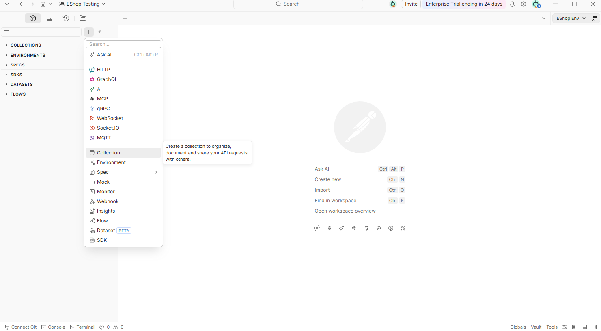
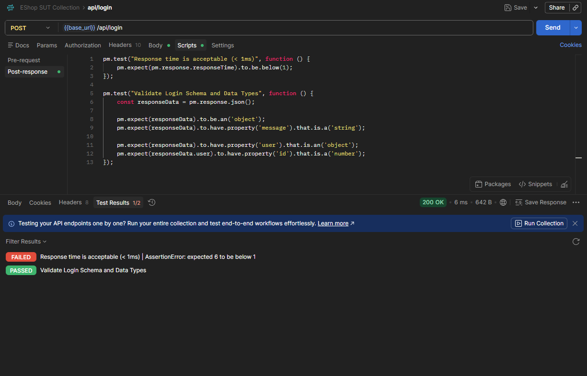

# User Guide: API Contract Testing with Postman & Postbot

## Section 1: Introduction

### What is API Testing?

API (Application Programming Interface) testing validates that the communication layer between software components works correctly — checking whether endpoints return the right data, handle errors properly, enforce authentication, and behave consistently under different inputs. Unlike UI testing, API testing operates directly on the request/response layer, making it faster, more reliable, and easier to automate.

### Why Postman?

**Postman** is the industry-standard tool for API testing, used by over 35 million developers worldwide. It provides an intuitive graphical interface for building, sending, and inspecting HTTP requests — without writing boilerplate code. Key features include:

- **Request Builder:** Compose GET, POST, PUT, DELETE requests with headers, parameters, and body — all through a visual interface.
- **Test Scripts:** Write JavaScript assertions (`pm.test()`) to validate status codes, response bodies, headers, and performance.
- **Collection Runner:** Execute an entire workflow (e.g., Login → Browse Products → Add to Cart → Checkout) in one click.
- **Newman CLI:** Run collections from the command line for automation and CI/CD pipeline integration.
- **Environment Variables:** Manage dynamic values (base URLs, tokens, credentials) across different setups.

### Why Postbot?

**Postbot** is Postman's built-in AI assistant (GA since 2024). It analyzes your request/response and automatically generates test assertions in JavaScript — reducing the effort of writing repetitive validation code. You can interact with Postbot through natural language prompts (e.g., *"Generate tests for status code and validate that each product has a positive price"*). Postbot is included in every Postman account at **50 AI credits per month** on the Free plan — sufficient for student and individual use.

### Tool Selection Context

This guide is part of a **Tool Survey** conducted for the Software Testing seminar. Three candidate tools were evaluated:

| Tool | Role | Verdict |
|------|------|---------|
| **Postman** | Traditional API testing tool | **Selected** — industry standard, low learning curve, excellent fit for e-commerce API flows |
| **Postbot** | AI-augmented test generation | **Selected** — rapidly generates assertions for complex JSON payloads, complements Postman |
| **Pact** | Contract testing (backup) | Not used in this seminar — designed for microservices; overkill for the monolithic EShop SUT |

The combination of **Postman + Postbot** was chosen because it eliminates framework complexity while providing both manual control and AI-assisted speed.

### Scope of This Guide

This guide focuses on three core capabilities:

1. **Test Scripts** — Writing JavaScript assertions to validate API responses (status codes, body structure, data types, response time).
2. **Collection Runner + Newman** — Automating end-to-end API workflows and running tests from the command line.
3. **Postbot (AI-augmented)** — Using Postman's AI assistant to generate test assertions, and understanding its strengths and limitations.

Additional features (Mock Servers, Monitors, Postman Flows, OpenAPI Import) are mentioned briefly in Section 5 but are not the primary focus.

### Target System

All examples in this guide use the **EShop SUT** (System Under Test) — a Node.js/Express e-commerce API provided for the course. The backend runs at `http://localhost:3000` and exposes endpoints for authentication, products, cart, checkout, coupons, and order management.

> **Note:** The EShop SUT contains intentional implementation gaps for learning purposes. This guide focuses on **how to use Postman and Postbot effectively**, not on finding bugs in the SUT.

---

## Section 2: Install & Setup

### Installation

1. **Postman Desktop App** — Download from https://www.postman.com/downloads/ (Windows/macOS/Linux)

   
2. **Create a Free Account** — 1 user, 50 AI credits/month (sufficient for Postbot)

   
3. **Newman CLI** — Requires Node.js & npm. Install via terminal:
   - Check if Node.js and npm are already installed by running:
     ```bash
     node -v
     npm -v
     ```
   - If not installed, download and install Node.js (which includes npm) from https://nodejs.org/.
   - Once Node.js & npm are verified, install Newman and the HTML reporter:
     ```bash
     npm install -g newman
     npm install -g newman-reporter-html
     ```

### Setup Environment in Postman

1. **Open/Create a Workspace**:
   - In the top-left corner of Postman, click **Workspaces**.
   - Select an existing workspace, or click **Create Workspace** to create a new workspace for your project (e.g., named "EShop Testing" for the EShop project).

     

     - Choose the appropriate **Visibility** type depending on your needs:
       - **Internal**: Only accessible by you (best for solo testing).
       - **Partner**: Shared with invited team members (best for group collaboration).
       - **Public**: Visible to anyone on the internet (used for publishing API docs).
2. **Create Collection**: In the left sidebar, click the **Collections** tab → click the plus button (`+`) or **Create Collection** → name your collection according to your project (e.g., "EShop API Collection"). A collection is a container that groups and organizes your API requests, making it easier to manage, run, and share tests.
   
3. **Create a new Environment**: Click the plus button (`+`) at the top of the left sidebar → select **Environment** → name it according to your project environment (e.g., "EShop Env").

   
4. **Add variables**: Add the required environment variables to store configuration values (such as URL, authentication credentials, dynamic parameters). Below is an example of configuration variables for the **EShop** system under test (SUT):

| Variable | Initial Value | Description |
|----------|--------------|-------------|
| `base_url` | `http://localhost:3000` | URL of EShop SUT |
| `username` | `test@eshop.com` | Test user |
| `password` | `Test1234!` | Test password |
| `auth_token` | *(leave empty)* | Authentication token (JWT) |
| `product_id` | *(leave empty)* | Product ID for testing |

5. **Select the Environment**: Choose the newly created environment (e.g., "EShop Env") from the environment dropdown in the top-right corner of Postman to apply the variables.

   

6. **Import Collection & Environment**: Import your project's API Collection and Environment files (e.g., the exported `.json` files of EShop API). Press `Ctrl + O` (or click the **Import** button in the left sidebar) → select the `.json` collection and environment files.

   

### Verify Connection

To verify that the setup is successful and the environment variables are active:
- Select a simple test endpoint in your collection (e.g., `GET {{base_url}}/api/products` in EShop).
- Click **Send**.
- If you receive a JSON response with status code `200 OK` (or other expected successful status), the connection is verified and successful.

  

---

## Section 3: First Test — Basic API Requests

### 4 Basic HTTP Methods

1. **GET `/api/products`** — Retrieve the list of products from SUT.
   - **Request Body**: None
   - **Response**: List of products in JSON format.
   

2. **POST `/api/login`** — Login and receive the JWT authentication token.
   - **Request Body**: `{ "email": "...", "password": "..." }`
   - **Response**: JSON containing the token.
   

3. **PUT `/api/products/:id`** — Update a product's details.
   - **Path Variables**: Set the target `id` value under the **Params** tab.
   - **Request Body**:
    ```json
    { 
        "name": "Tên sản phẩm",
        "price": 100000,
        "description": "Mô tả",
        "imageUrl": "http://...",
        "category_id": 1
    }
    ```
   - **Response**: The updated product JSON.
   

4. **DELETE `/api/products/:id`** — Delete a product by its ID.
   - **Path Variables**: Set the target `id` value under the **Params** tab.
   - **Request Body**: None
   - **Response**: Status confirmation.
   


### Common HTTP Status Codes

| Code | Meaning | Occurrences |
|------|---------|-------------|
| **200** OK | Success | Successful GET or PUT request |
| **201** Created | Created | Successful POST request creating a resource |
| **400** Bad Request | Bad Input | Missing fields or invalid data types |
| **401** Unauthorized | Unauthenticated | Missing or invalid token |
| **403** Forbidden | Unauthorized | Valid token but lack of permissions |
| **404** Not Found | Not Found | Resource does not exist |
| **409** Conflict | Conflict | E.g., coupon has already been redeemed |
| **500** Internal Server Error | Server Error | Bug on the server-side |

### Authorization Tab in Postman

1. Open your Collection (or folder) → click the **Authorization** tab.
2. Select **Type**: `Bearer Token` → set **Token**: `{{auth_token}}`.
3. All child requests in this Collection will automatically inherit the `Authorization: Bearer <token>` header.
4. No need to manually set the Authorization header for each individual request.

---

## Section 4: API Authentication Testing Patterns

This section demonstrates how Postman handles authentication — specifically **JWT Bearer Token**, which is the auth mechanism used by the EShop SUT. You will learn how to configure auth at the Collection level, test auth failure scenarios, and automate token management with scripts.

### 4.1 — Collections and Auth Inheritance

In Postman, a **Collection** is a group of related API requests. Collections can contain **sub-folders** to organize requests by feature (e.g., "Auth", "Products", "Cart").

A key feature is **inheritance**: authorization settings applied at the Collection or folder level are automatically inherited by all child requests. This means you configure auth **once** at the top level, and every request inside automatically uses it — no need to set headers manually per request.

> **Watch the video below** to see how Collections, folders, and auth inheritance work in Postman.

<video width="100%" controls>
  <source src="hoang/Hoang_postman_vid_01.mp4" type="video/mp4">
  Your browser does not support the video tag.
</video>

### 4.2 — Testing Authentication with Bearer Token

The EShop SUT uses **JWT Bearer Token** authentication. After logging in, the server returns a token that must be included in the `Authorization` header of subsequent requests:

```
Authorization: Bearer <token>
```

In Postman, you configure this at the **Collection level**:
1. Select your Collection → click the **Authorization** tab
2. Set **Type** to `Bearer Token`
3. Enter `{{auth_token}}` as the Token value (referencing the environment variable)

All child requests now automatically include this header.

#### Testing Auth Failure Scenarios

A critical part of auth testing is verifying that the API **rejects** unauthorized requests. Here are two common test cases:

| Test Case | Setup | Expected Result |
|-----------|-------|----------------|
| **No token** | Remove the Bearer token (set Authorization to "No Auth") | `401 Unauthorized` |
| **Fake/invalid token** | Enter a random string as the token | `403 Forbidden` |

> **Watch the video below** to see how to run a request and test both auth failure scenarios in Postman.

<video width="100%" controls>
  <source src="hoang/Hoang_postman_vid_02.mp4" type="video/mp4">
  Your browser does not support the video tag.
</video> 

> *Video 2*: Running GET /api/users/me with Bearer Token auth, then testing no-token (401) and fake-token (403) scenarios.

### 4.3 — Auto-Save Token with Post-Response Script

When testing authenticated APIs, you typically need to:
1. Send a login request → receive a token
2. **Copy** the token → **paste** it into the environment variable
3. Use the variable in subsequent requests

Manually copying the token every time is tedious and error-prone. Postman solves this with **post-response scripts** — JavaScript code that runs automatically after a request completes.

By adding a short script to the login request's **Post-response** tab, the token is automatically extracted from the response and saved to the `{{auth_token}}` environment variable:

```javascript
const responseData = pm.response.json();

if (pm.response.code === 200 && responseData.token) {
    pm.environment.set("auth_token", responseData.token);
    console.log("auth_token saved to environment");
}
```

After running the login request once, `{{auth_token}}` is automatically populated — all subsequent requests using `Authorization: Bearer {{auth_token}}` work immediately without any manual copy-paste.

> **Watch the video below** to see the problem (manual token copy) and the solution (post-response script) in action.

<video width="100%" controls>
  <source src="hoang/Hoang_postman_vid_03.mp4" type="video/mp4">
  Your browser does not support the video tag.
</video> 

> *Video 3: Demonstrating the manual token copy problem, then introducing the post-response script that automatically overrides the `auth_token` variable after login.*

---

## Section 4b: Contract Testing with Postman

> **Author:** Thuận | **Reference:** `DEEP_RESEARCH_Contract_Testing_Postman.md`

### What is Contract Testing?

*[Thuận: Write 2-3 paragraphs explaining contract testing — what it is, why it matters, how it differs from schema validation. Reference the research report Section 1.]*

### How Postman Implements Contract Testing

*[Thuận: Explain Postman's built-in features — JSON Schema validation via `pm.response.to.have.jsonSchema()`, response structure assertions, Mock Servers. Reference the research report Section 2.]*

### Examples from EShop SUT

*[Thuận: Show JSON Schema examples for EShop SUT endpoints (products, cart, orders). Include code snippets for post-response scripts. Reference the research report Section 3.]*

### Comparison: Postman vs. Dedicated Contract Testing Tools

*[Thuận: Add a comparison table (Postman vs. Pact) explaining when to use each. Reference the research report Section 4.]*

---

## Section 5: Advanced Usage

### 5.1a — Test Scripts

### Test Scripts in Postman
API testing requires more than just checking if a request returns a `200 OK` status. Postman allows testers to write JavaScript code to automate data preparation and validate complex API behaviors. 

Think of these scripts as the automated logic surrounding your API calls. They are divided into two distinct execution phases:
1. **Pre-request Scripts:** Code that executes *before* the HTTP request is sent to the server.
2. **Post-response Scripts (Tests):** Code that executes *after* the HTTP response is received from the server.

### How to Navigate to the Scripts Interface
Before diving into the code, here is how you can locate the scripting workspace in Postman:
1. Open any API request in your Collection.
2. Look at the tab menu directly below the URL bar and click on the **Scripts** tab.
   
3. Inside the Scripts tab, you will see two sub-tabs: **Pre-request** and **Post-response**. Select the appropriate tab based on when you want your code to run.
   
4. Write your JavaScript code in the editor below and click **Save** (or press `Ctrl + S`).

#### 1. Pre-request Scripts (Dynamic Data Preparation)
These scripts run before the request is sent to prepare the environment and payload. This is primarily used to prevent data collisions, such as dynamically generating a unique email for each test run to avoid "User already exists" errors.

If we were testing a registration endpoint, we could use this setup phase to generate a dynamic email to ensure a clean test run every time:
```javascript
pm.environment.set("timestamp", Date.now());
const randomEmail = `user_${Math.floor(Math.random() * 10000)}@test.com`;
pm.environment.set("test_email", randomEmail);
```

#### 2. Post-response Scripts (Assertions & Variable Chaining)
Once the server replies, you need to verify if the data is correct or extract specific values to use in future requests. This is handled in the Post-response tab (historically called "Tests" in older Postman versions).

**Variable Chaining:** Instead of manually copying authentication tokens from one response to another, we can extract the token from a Login response and store it dynamically for future use.<br>
For example, capturing the token from the `POST {{base_url}}/api/auth/login` response to automatically update your `{{auth_token}}` environment variable.

```javascript
const responseData = pm.response.json();

pm.test("Save Auth Token and User ID", function () {
    pm.environment.set("auth_token", responseData.token);
    pm.environment.set("user_id", responseData.user.id);
});
```

**Data Validation:** Beyond extracting variables, Post-response scripts are crucial for validating the structure and performance of the returned data. We achieve this using the built-in Chai.js assertion library inside the `pm.expect()` block.<br>
For example, here is how you assert the schema and response time for the `GET {{base_url}}/api/products` endpoint.

```javascript
pm.test("Response time is acceptable (< 800ms)", function () {
    pm.expect(pm.response.responseTime).to.be.below(800);
});

pm.test("Validate Product Schema and Data Types", function () {
    const products = pm.response.json();
    pm.expect(products).to.be.an('array').that.is.not.empty;
    
    // Validate the exact data types of the first product
    const firstProduct = products[0];
    pm.expect(firstProduct).to.have.property('id').that.is.a('number');
    pm.expect(firstProduct.price).to.be.a('number').and.to.be.above(0);
});
```

#### 3. Viewing Test Results
After you click **Send**, Postman executes your Post-response scripts and evaluates every `pm.test()` block. You can view the outcome by looking at the lower half of the Postman interface and clicking on the Test Results tab.

The string you provide in the `pm.test("Name", ...)` function becomes the visual label for your test.
- **When a test passes:** If all `pm.expect()` conditions inside the block evaluate to true, Postman flags it with a green **PASS** badge.
- **When a test fails:** If even a single assertion fails, the entire block gets a red **FAIL** badge, and Postman prints an error message explaining exactly what went wrong.

Using the `GET /api/products` script above as an example, and to see exactly how Postman reports these outcomes, let's intentionally force a failure. We will keep our schema validation intact, but we will change our response time assertion to expect an impossibly fast < 1ms return time:

```javascript
pm.test("Response time is acceptable (< 1ms)", function () {
    pm.expect(pm.response.responseTime).to.be.below(1);
});

pm.test("Validate Product Schema and Data Types", function () {
    const products = pm.response.json();
    pm.expect(products).to.be.an('array').that.is.not.empty;
    
    // Validate the exact data types of the first product
    const firstProduct = products[0];
    pm.expect(firstProduct).to.have.property('id').that.is.a('number');
    pm.expect(firstProduct.price).to.be.a('number').and.to.be.above(0);
});
```

When you run this script, Postman provides immediate visual feedback:
- The `Validate Product Schema` test evaluates to true, so Postman flags it with a green PASS badge.
- Since the API cannot return data in under 1 millisecond, the `Response time` test gets a red FAIL badge. Furthermore, Postman prints the exact `AssertionError` (e.g., expected 5 to be below 1) to help you debug what went wrong.



This immediate visual feedback is what makes Postman scripts so powerful. Instead of manually reading the JSON response every time, you rely on the Test Results tab to confidently confirm that the API contract is intact.

#### 4. Quick Reference: Common Postman Commands
To help you write and understand scripts faster, here is a cheat sheet of the most frequently used Postman commands and Chai.js assertions:

| Command / Assertion | Description |
| :--- | :--- |
| `pm.environment.set("key", value)` | Creates or updates a variable in your active Environment. Useful for variable chaining. |
| `pm.environment.get("key")` | Retrieves the value of an existing Environment variable. |
| `pm.response.json()` | Parses the raw response body into a readable JavaScript object/array. |
| `pm.test("Name", function() {...})` | Wraps your validation logic. The "Name" will appear in your Postman test result reports. |
| `pm.response.to.have.status(200)` | A quick assertion to verify the HTTP status code returned by the server. |
| `pm.expect(A).to.eql(B)` | Asserts that value A is strictly equal to value B. |
| `pm.expect(obj).to.have.property('id')` | Validates that a specific key (e.g., 'id') exists within a JSON object. |
| `pm.expect(obj.id).to.be.a('number')` | Checks the exact data type of a value (can be `'number'`, `'string'`, `'boolean'`). |
| `pm.expect(arr).to.be.an('array').that.is.not.empty` | Ensures the returned data is an array and contains at least one item. |
| `pm.expect(time).to.be.below(800)` | Asserts that a numeric value is less than a specified target (great for performance testing). |

### 5.1b — Negative Testing & Error Handling

Happy-path testing (verifying that valid inputs yield successful outputs) only covers a fraction of your API's contract. Negative Testing involves intentionally sending invalid, malformed, or unauthorized data to see how the system reacts.

As an API tester, your primary goal in this phase is to ensure the server handles bad data gracefully. The API must catch the invalid input and return standard, predictable client error codes (4xx series) rather than crashing or exposing backend logic (500 Internal Server Error).

**Best Practice:** Always organize your negative tests in a dedicated folder (e.g., "Negative Tests") within your Postman collection. This separates your test logic and makes your automated test reports much easier to analyze.

To understand how to approach negative testing, let's explore the most common edge cases you need to cover. We will use EShop as a running example to demonstrate how these tests are written in Postman:

#### 1. Unauthorized Access
Secure endpoints must actively reject unauthenticated requests. 

If you attempt to access protected resources like `GET {{base_url}}/api/products` without providing a valid `{{auth_token}}` credential, the server must block the request.  

```javascript
pm.test("Unauthorized access returns 401", function () {
    pm.response.to.have.status(401);
});
```

#### 2. Missing Required Fields
APIs must validate structural integrity before processing logic. 

The `POST {{base_url}}/api/cart` endpoint strictly requires a `user_id`, `product_id`, and `quantity`. If a client omits any mandatory field, the server must catch it and return a standard `400 Bad Request`.  

```javascript
pm.test("Missing product_id returns 400 with an error message", function () {
    pm.response.to.have.status(400);
    pm.expect(pm.response.json()).to.have.property('error').that.is.a('string');
});
```

#### 3. Boundary Values & Business Logic
These are critical scenarios that basic automated tools often miss. For our EShop example, this includes:
- **Invalid Quantities:** Submitting `POST {{base_url}}/api/cart` with a `quantity` of 0 or lower.  
- **Invalid States:** Submitting `POST {{base_url}}/api/coupon/redeem` with a fabricated or expired code instead of the valid "SAVE20".  

```javascript
pm.test("Zero quantity is rejected by validation (Status 400)", function () {
    pm.response.to.have.status(400);
});
```

#### 4. JSON Schema Validation for Errors
Manually validating individual fields in an error response can be tedious. Instead, use Postman's built-in JSON Schema validator (Ajv). You can define a strict "Error Contract" (e.g., RFC 7807) and validate the entire error payload in a single line of code. This ensures your API never returns undocumented error formats.

When triggering a validation error in the Cart API, we use a JSON schema to guarantee the error response always contains exactly three fields: `error_code`, `message`, and `timestamp`.
```javascript
const errorSchema = {
    "type": "object",
    "required": ["error_code", "message", "timestamp"],
    "properties": {
        "error_code": { "type": "string" },
        "message": { "type": "string" },
        "timestamp": { "type": "string", "format": "date-time" }
    },
    "additionalProperties": false // Fails if the server leaks extra data
};

pm.test("Error response strictly matches the Error JSON Schema", function () {
    pm.response.to.have.jsonSchema(errorSchema);
});
```

#### 5. Rate Limiting Validation (Status 429)
A robust API must protect itself from brute-force attacks or spam by implementing rate limits. Negative testing should verify that if a client sends too many requests in a short window, the server gracefully intercepts them and returns a 429 Too Many Requests status, along with a Retry-After header.

Using the Postman Collection Runner (which is covered in `Section 5.2`), we can loop the `POST /api/auth/login` request 50 times with zero delay. We then write a script to assert that the server eventually stops returning `401s (Invalid Credentials)` and starts returning 429s to prevent spam.

```javascript
pm.test("API throttles spam requests with 429 Too Many Requests", function () {
    pm.expect(pm.response.code).to.be.oneOf([400, 401, 429]);
    
    if (pm.response.code === 429) {
        pm.expect(pm.response.headers.has('Retry-After')).to.be.true;
    }
});
```

#### 6. Dynamic Error Handling (Conditional Workflows)
How does your automated test suite handle an unexpected error? Instead of letting the Collection Runner blindly execute downstream requests that will inevitably fail (e.g., trying to add to a cart without a token), Postman allows you to dynamically control the execution flow using `postman.setNextRequest()`.

If the `POST /api/auth/login` request fails (e.g., the test server is down or credentials changed), we instruct Postman to immediately halt the test suite rather than wasting time executing the Products and Cart endpoints.

```javascript
pm.test("Login must be successful to continue workflow", function () {
    if (pm.response.code !== 200) {
        console.error("Login failed! Halting the automation suite.");
        // Passing 'null' stops the Collection Runner completely
        postman.setNextRequest(null); 
    } else {
        pm.expect(pm.response.code).to.eql(200);
    }
});
```

### 5.2 — Collection Runner & Newman CLI

#### Collection Runner (GUI)
The Collection Runner allows you to run your entire Postman Collection in a specified sequence. This is essential for testing a complete integration workflow (for example, the E-commerce integration flow: Login → Retrieve Products → Add to Cart → Place Order) to ensure variable chaining works seamlessly as an end-to-end integration test instead of isolated request executions.

1. **Open the Runner**: Right-click your collection in the left sidebar (e.g., **EShop API Collection**) and select **Run**.
2. **Configure Run Settings**:
   - **Functional/Manual**: Select the requests you want to include in the run (uncheck any requests you wish to skip).
   - **Iterations**: Set the number of times the Collection should run (default is `1`).
   - **Delay**: Add a delay (in milliseconds) between request executions to prevent rate-limiting or overloading the SUT.
3. **Run the Collection**: Ensure the target environment (e.g., `"EShop Env"`) is active, then click the **Run <Collection Name>** button (e.g., **Run EShop API Collection**).
4. **Analyze Results**: Postman displays a real-time summary of the run. You can view the status of each request and inspect the assertion pass/fail details.
   


#### Exporting Collections & Environments
To execute your tests from the command line via Newman, you must first export your collection and environment configurations:
- **Export Collection**: Click the ellipsis button (`...`) next to your Collection name → **More** → select **Export collection** → save as a `.json` file (e.g., `EShop_API_Collection.json`).
- **Export Environment**: Select the **Environments** tab in the left sidebar → click the ellipsis button (`...`) next to your environment (e.g., `"EShop Env"`) → select **Export** → save as a `.json` file (e.g., `EShop_Environment.json`).


#### Newman CLI
Newman is a command-line collection runner for Postman. It allows you to run and test Postman collections directly from the command line, making it perfect for integration with CI/CD pipelines.

1. **Running Collections**: Execute the run command by passing your exported collection and environment files. For example, to run the EShop collection:
   ```bash
   newman run "EShop_API_Collection.json" -e "EShop_Environment.json"
   ```
2. **Generating Reports**: Newman supports multiple reporting formats to save your test results. For example, to run and export reports for the EShop collection:
   - **CLI (Terminal Table)**: Included by default.
   - **HTML Report**: Generates a detailed HTML report file that can be opened in any web browser.
     ```bash
     newman run "EShop_API_Collection.json" -e "EShop_Environment.json" -r cli,html --reporter-html-export "report.html"
     ```
     

   - **JSON Report**: Useful for programmatically parsing test results.
     ```bash
     newman run "EShop_API_Collection.json" -e "EShop_Environment.json" -r cli,json --reporter-json-export "results.json"
     ```
   - **JUnit XML Report**: Standard format widely supported by CI/CD build tools.
     ```bash
     newman run "EShop_API_Collection.json" -e "EShop_Environment.json" -r cli,junit --reporter-junit-export "results.xml"
     ```

#### Report formats & Metrics
Below is a comparison of the available report formats:

| Format | Description | Key Metrics to Inspect |
|--------|-------------|-------------------------|
| **CLI** | Displayed directly on terminal. | Summary tables showing passed/failed checks. |
| **HTML** | Rich visualization page opened in browser. | Total assertions, average response time, and detailed request failures. |
| **JSON** | Raw test result data. | Structured metrics for script parsing. |
| **JUnit XML** | Standard CI-ready XML format. | Compatibility metrics for CI/CD dashboards (e.g. Jenkins). |

#### Data-Driven Testing
Data-driven testing allows you to run a single request (or the entire flow) multiple times with different sets of test data provided by an external file (CSV or JSON).

**Example Scenario**: We want to test the `POST /api/login` endpoint with 5 different credentials combinations to verify both successful logins (200 OK) and negative validation cases (e.g., missing credentials or wrong password).

1. **Prepare the Data File (`login_data.csv`)**:
   Create a CSV file with headers mapping to variables used in your requests. Each row represents a single iteration:
   ```csv
   username,password,expected_status
   test@eshop.com,Test1234!,200
   bob@eshop.com,Password456!,200
   test@eshop.com,wrong_password,401
   (empty),Test1234!,400
   charlie@eshop.com,(empty),400
   ```
2. **Accessing Iteration Data in Test Scripts**:
   Modify your tests to retrieve values dynamically from the iteration data using `pm.iterationData.get("column_name")`. The script automatically verifies whether the actual HTTP status matches the `expected_status` value for that row:
   ```javascript
   const expectedStatus = pm.iterationData.get("expected_status");

   pm.test("Status code is " + expectedStatus, function () {
       pm.response.to.have.status(parseInt(expectedStatus));
   });
   ```

3. **Running Iterations in Collection Runner**: There are 2 ways to feed test data:
   - **Method 1: Using a Test Data File (Requires an Enterprise account)**:
     - In the Collection Runner configuration, look for the **Test data file** section.
     - Click **Select File** and upload the data file directly (e.g., `login_data.csv`).
     - Postman will automatically set the number of **Iterations** to match the rows in the file and run them sequentially.

        

   - **Method 2: Using Datasets & Data Views (Free for all account types)**:
     - **Create a Dataset**: Click the plus (`+`) icon next to the **Datasets** section in the Collection Runner configuration to create a new dataset and name it (e.g., `Test login dataset`).

       

     - **Add Data Sources**: In the **Data source(s)** section, select your data source type (e.g., choose **Local File** to drag-and-drop or upload your `.csv` file), then click **Add source** to add a new data source (e.g., `source_login_data`).
     - **Create Data Views**: Postman will automatically generate a default view (e.g., `source_login_data_default_view`). You can click **Create view** to add custom views to filter your data as desired.

       

     - **Configure the Runner**: In the Collection Runner configuration, choose the data source as **Dataset** and select the correct **Data view** you just created to use as the input test data.

        
     

4. **Running Iterations in Newman**:
   Run the test suite using the `--iteration-data` (or shorthand `-d`) flag and specify the data file. For example, running the EShop login iteration tests:
   ```bash
   newman run "EShop_API_Collection.json" -e "EShop_Environment.json" -d "login_data.csv" --iteration-count 5
   ```


### 5.3 — Postbot: AI-Generated Tests


---

## Section 6: Failure Modes — 3 Cách Postman/Postbot Đánh Lừa Bạn

---

## Section 7: Troubleshooting

This section covers the most common errors you will encounter when working with Postman, Postbot, and Newman — along with their causes and solutions.

### 7.1 — `ECONNREFUSED` — Cannot Connect to Server

**Symptom:** When sending a request, Postman (or Newman) returns an error similar to:
```
Error: connect ECONNREFUSED 127.0.0.1:3000
```

**Cause:** The target server (e.g., EShop SUT) is not running, or the `base_url` environment variable points to the wrong host/port.

**Solution:**
1. Verify that the EShop SUT server is running.
2. Check your Environment variables — ensure `base_url` is set correctly (e.g., `http://localhost:3000`).
3. Confirm the port number matches the server's actual listening port (check the server's terminal output for messages like `Server running on port 3000`).
4. If the server runs on a different machine or inside a Docker container, replace `localhost` with the correct hostname or IP address.

---

### 7.2 — `{{auth_token}}` is Undefined — Variable Not Set

**Symptom:** Requests to protected endpoints fail with `401 Unauthorized`, and hovering over `{{auth_token}}` in Postman shows it as **unresolved** or **undefined**.

**Cause:** The authentication token was never saved to the environment. This typically happens when:
- You forgot to run the Login request before accessing protected endpoints.
- The Login request's Post-response script that saves the token is missing or has a bug.
- You ran requests out of order in the Collection Runner (e.g., skipped the Login step).

**Solution:**
1. **Run the Login request first.** Ensure `POST /api/login` is executed before any request that requires authentication.
2. **Verify the Post-response script** on the Login request saves the token correctly:
   ```javascript
   const responseData = pm.response.json();
   if (pm.response.code === 200 && responseData.token) {
       pm.environment.set("auth_token", responseData.token);
   }
   ```
3. **Check the Environment** — after running Login, click the "eye" icon (Environment Quick Look) in the top-right corner to confirm that `auth_token` has a **Current Value**.
4. **In Collection Runner**, ensure the Login request is positioned at the top of the execution order so it runs first.

---

### 7.3 — Postbot Does Not Show the "Ask Postbot" Button

**Symptom:** You open the Scripts (Tests) tab on a request, but the Postbot option or "Ask Postbot" button is not visible.

**Cause:** Postbot requires a **response sample** to generate test assertions — it analyzes the actual response body to produce relevant tests. If you have not sent the request yet, Postbot has no data to work with. Additionally, your AI credits may be exhausted.

**Solution:**
1. **Send the request first** — click **Send** to execute the request and receive a response. Once the response appears, Postbot's option should become available.
2. **Check your AI credits** — go to your Postman account settings or the billing page to verify that you still have available AI credits. The Free plan provides **50 credits/month**; each Postbot generation consumes approximately 1 credit.
3. **Ensure you are signed in** — Postbot requires an authenticated Postman account. If you are using Postman without signing in, Postbot features will not be available.

---

### 7.4 — Newman Reports `collection could not be loaded` or `collection not found`

**Symptom:** Running Newman from the command line produces an error like:
```
error: collection could not be loaded
  unable to read data from file "EShop_API_Collection.json"
```

**Cause:** The file path to the exported Collection JSON is incorrect, the file does not exist at the specified location, or you forgot to export the Collection from Postman.

**Solution:**
1. **Verify the file path** — ensure the `.json` file exists in the directory where you are running the Newman command. Use `ls` (macOS/Linux) or `dir` (Windows) to list files:
   ```bash
   # macOS/Linux
   ls -la *.json

   # Windows (PowerShell)
   dir *.json
   ```
2. **Use the correct file name** — double-check for typos in the file name (case-sensitive on macOS/Linux).
3. **Export the Collection** if you have not already:
   - In Postman, click the ellipsis (`...`) next to your Collection → **Export** → save as `.json`.
4. **Use absolute paths** if the file is in a different directory:
   ```bash
   newman run "C:/Users/admin/exports/EShop_API_Collection.json" -e "C:/Users/admin/exports/EShop_Environment.json"
   ```

---

### 7.5 — Assertion Fails with No Clear Reason — Use Postman Console

**Symptom:** A test assertion fails (red FAIL badge), but the error message is generic or does not clearly explain what went wrong. For example:
```
AssertionError: expected undefined to be a number
```

**Cause:** The response body may have a different structure than expected (e.g., a field is missing, nested differently, or the endpoint returned an error response instead of the expected data). Without logging, it is difficult to see the actual response content that caused the failure.

**Solution:**
1. **Open the Postman Console** — press `Ctrl + Alt + C` (Windows/Linux) or `Cmd + Alt + C` (macOS) to open the Console panel. The Console displays detailed logs for every request/response, including headers, body, and any `console.log()` output from your scripts.
2. **Add `console.log()` statements** to your test scripts to inspect the actual response data:
   ```javascript
   const responseData = pm.response.json();
   console.log("Response body:", JSON.stringify(responseData, null, 2));
   console.log("Status code:", pm.response.code);

   pm.test("Product has an id field", function () {
       pm.expect(responseData).to.have.property('id').that.is.a('number');
   });
   ```
3. **Re-run the request** and check the Console output to see the exact response body. This will reveal whether the field exists, is named differently, or if the API returned an error response.
4. **Common root causes:**
   - The API returned an error object (e.g., `{ "error": "Unauthorized" }`) instead of the expected data — your script tried to access a field that only exists in successful responses.
   - A field name is different from what you expected (e.g., `product_id` vs. `productId`).
   - The response is an array, but your script treats it as an object (or vice versa).

---

### 7.6 — Newman HTML Report Does Not Generate

**Symptom:** Running Newman with the `-r html` reporter flag does not produce an HTML file, or Newman throws an error like:
```
error: reporter "html" could not be loaded
```

**Cause:** The `newman-reporter-html` package is not installed. Unlike the CLI reporter (which is built-in), the HTML reporter is a separate npm package that must be installed globally.

**Solution:**
1. **Install the HTML reporter globally:**
   ```bash
   npm install -g newman-reporter-html
   ```
2. **Re-run your Newman command** with the HTML reporter:
   ```bash
   newman run "EShop_API_Collection.json" -e "EShop_Environment.json" -r cli,html --reporter-html-export "report.html"
   ```
3. **Verify the output** — after a successful run, the `report.html` file will be created in the current directory. Open it in any web browser to view the detailed test report.
4. **If the issue persists**, check your npm global installation path:
   ```bash
   npm list -g --depth=0
   ```
   Ensure both `newman` and `newman-reporter-html` appear in the list. If not, re-install them.

---

## Section 8: References

### AI Disclosure (theo Seminar_Guide.docx Section 7 — AI Policy)

